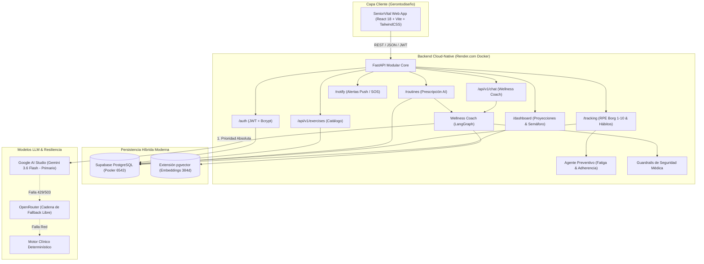

# 🌿 SeniorVital — Ecosistema Inteligente de Bienestar Gerontológico

> **Materia:** Ingeniería de Software y Base de Datos  
> **Docente Titular:** Dra. Yaskelly Yedra  
> **Desarrolladores / Autores:** Daniel Alejandro Sánchez Ávila & Abdenago Nahmens  
> **Estándares de Ingeniería:** SWEBOK v4, ISO/IEC 25010, WCAG 2.1 AA  

[](https://fastapi.tiangolo.com)
[](https://www.python.org/)
[](https://supabase.com/)
[](https://aistudio.google.com/)
[](https://openrouter.ai/)
[](https://seniorvital-backend.onrender.com)
[](https://github.com/danielsanchez040601-byte/SeniorVital---Backend-API/actions)
[](LICENSE)

---

## 📖 1. Resumen Ejecutivo y Propósito

**SeniorVital** es una solución tecnológica integral de salud digital (*HealthTech / Silver Economy*) diseñada para preservar la autonomía motriz, mitigar la sarcopenia y brindar acompañamiento proactivo a personas mayores de 60 años.

La plataforma fusiona una arquitectura **Monolito Modular asíncrono con FastAPI**, un **Ecosistema Multi-Agente con LangGraph**, memoria semántica vectorial basada en **`pgvector`** sobre **Supabase PostgreSQL**, y capacidades de inferencia en tiempo real mediante **Google AI Studio (`gemini-3.6-flash`)** con una cadena de tolerancia a fallos en **OpenRouter**.

---

## 🏛️ 2. Arquitectura General del Sistema



---

## 🗂️ 3. Estructura del Repositorio

```text
SeniorVital/
├── .github/
│   └── workflows/
│       └── ci.yml                             # Pipeline CI/CD automatizado con GitHub Actions
├── app/                                       # Backend FastAPI Modular (Clean Architecture)
│   ├── agents/
│   │   ├── llm_client.py                      # Conector Google AI Studio + Fallback OpenRouter
│   │   ├── preventive_agent.py                # Detección de fatiga Borg RPE y alertas clínicas
│   │   └── wellness_coach.py                  # Agente conversacional LangGraph con guardrails
│   ├── routers/
│   │   ├── auth.py                            # Autenticación JWT y roles RBAC (Senior/Caregiver/Admin)
│   │   ├── chat.py                            # Chat seguro con el asistente
│   │   ├── dashboard.py                       # Proyecciones funcionales y matriz de residentes
│   │   ├── exercises.py                       # Catálogo geriátrico (/api/v1/exercises y /catalog)
│   │   ├── notify.py                          # Web Push Notifications y alertas SOS
│   │   ├── routines.py                        # Generación y consulta de rutinas diarias
│   │   └── tracking.py                        # Registro de esfuerzo Borg RPE e hidratación/sueño
│   ├── tools/
│   │   └── vector_tools.py                    # Búsqueda semántica con pgvector
│   ├── config.py                              # Gestión centralizada de configuración Pydantic
│   ├── database.py                            # Conexión asíncrona al Pooler Supabase (PgBouncer 6543)
│   ├── main.py                                # Aplicación principal, CORS y arranque no bloqueante
│   ├── models.py                              # Modelos ORM SQLAlchemy relacionales y vectoriales
│   ├── schemas.py                             # DTOs y validación con Pydantic (tolerancia UUID/int)
│   └── vectorstore.py                         # Memoria semántica gerontológica
├── seniorvital-frontend/                      # Aplicación Cliente (React 18 + Vite + TailwindCSS)
│   ├── src/
│   │   ├── pages/                             # 6 Vistas: Home, Video, Caregiver, Habits, Progress, Admin
│   │   ├── components/                        # 6 Componentes: Auth, TopBar, BottomNav, SOS, Modal
│   │   └── api.js                             # Conector HTTP con backend y caché local
│   ├── package.json
│   └── vite.config.js                         # Configuración Vite (Puerto 3000)
├── docs/                                      # Documentación Viva de los 4 Sprints
│   ├── 1_Especificaciones_Funcionales_y_No_Funcionales.md   # Sprint 1: Requisitos & ISO/IEC 25010
│   ├── 2_Product_Backlog_y_Casos_Uso.md                     # Sprint 1 & 2: User Stories Gherkin & CU
│   ├── 3_Analisis_Mercado_y_Tecnico.md                      # Sprint 2 & 4: FinOps & Cloud-Native
│   ├── 4_Diagrama_UML.md                                    # Sprint 1, 2 & 4: Diagramas Mermaid
│   ├── 5_Persistencia_y_DevOps.md                           # Sprint 3: Supabase pgvector & CI/CD
│   └── 6_Informe_Final_y_Articulo_Tecnico.md                # Sprint 4: Informe Ejecutivo & Cierre
├── Dockerfile                                 # Contenedor optimizado para despliegue en Render
├── requirements.txt                           # Dependencias versionadas del backend
├── .env.example                               # Plantilla pública de variables de entorno
└── README.md                                  # Documento principal del repositorio
```

---

## 🎯 4. Matriz de Cumplimiento por Sprints (Dra. Yaskelly Yedra)

| Sprint | Eje Temático | Entregables y Artefactos Implementados | Cumplimiento |
| :---: | :--- | :--- | :---: |
| **Sprint 1** | **Ingeniería de Requisitos y Calidad** | • Historias de usuario en formato Gherkin.<br>• Casos de uso estructurados (CU-01 a CU-08).<br>• Requisitos funcionales y no funcionales según **ISO/IEC 25010**.<br>• Diagramas UML en Mermaid (Clases, Casos de Uso, Secuencias, Estados). | **100%** ✅ |
| **Sprint 2** | **Arquitectura Cloud-Native** | • Monolito Modular asíncrono con **FastAPI** y contratos OpenAPI (`/docs`).<br>• Arquitectura desacoplada orientada a servicios.<br>• Contenedor **Dockerfile** parametrizado para **Render.com**.<br>• Análisis de Mercado, Técnico y FinOps comparativo vs GCP. | **100%** ✅ |
| **Sprint 3** | **Persistencia Híbrida + DevOps** | • Base de datos **Supabase PostgreSQL** con pooler PgBouncer (puerto 6543).<br>• Extensión **`pgvector`** para recuperación semántica de ejercicios.<br>• Pipeline CI/CD en **GitHub Actions** (`.github/workflows/ci.yml`).<br>• Arranque no bloqueante para despliegues sin *port timeout*. | **100%** ✅ |
| **Sprint 4** | **IA + Sistema Inteligente & Proyecto Final** | • Agente **Wellness Coach** y **Agente Preventivo** con guardrails clínicos.<br>• Inferencia primaria con **Google AI Studio (`gemini-3.6-flash`)**.<br>• Cadena de Fallback multi-proveedor en **OpenRouter**.<br>• Seguimiento de esfuerzo Borg RPE (1-10) y panel para cuidadores.<br>• Artículo técnico final y matriz de trazabilidad. | **100%** ✅ |

---

## 🚀 5. Guía de Puesta en Marcha (Desarrollo y Producción)

### 5.1 Ejecución Local del Backend

```bash
# 1. Clonar el repositorio
git clone https://github.com/danielsanchez040601-byte/SeniorVital---Backend-API.git
cd SeniorVital---Backend-API

# 2. Configurar entorno virtual Python
python -m venv venv
# Windows:
.\venv\Scripts\activate
# Linux/macOS:
source venv/bin/activate

# 3. Instalar dependencias
pip install -r requirements.txt

# 4. Configurar variables de entorno
cp .env.example .env

# 5. Iniciar servidor FastAPI
uvicorn app.main:app --host 0.0.0.0 --port 8000 --reload
```

* **Swagger UI:** [http://localhost:8000/docs](http://localhost:8000/docs)
* **ReDoc:** [http://localhost:8000/redoc](http://localhost:8000/redoc)

---

### 5.2 Ejecución Local del Frontend

```bash
cd seniorvital-frontend
npm install
npm run dev
```

* **Frontend Web:** [http://localhost:3000/](http://localhost:3000/)

---

### 5.3 Despliegue en la Nube (Producción en Render.com)

* **Backend Live URL:** [https://seniorvital-backend.onrender.com](https://seniorvital-backend.onrender.com)
* **Swagger Docs en Vivo:** [https://seniorvital-backend.onrender.com/docs](https://seniorvital-backend.onrender.com/docs)

---

## 👥 6. Equipo y Créditos Académicos

* **Daniel Alejandro Sánchez Ávila** — Arquitectura Backend, Integración LLM & DevOps.
* **Abdenago Nahmens** — Modelado de Datos, Persistencia Vectorial & Frontend.
* **Docente Titular:** Dra. Yaskelly Yedra
* **Cátedra:** Ingeniería de Software y Base de Datos — 2026
