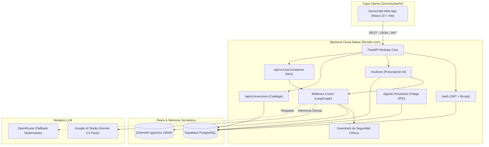

# 🌿 SeniorVital — Backend API & Ecosistema Multi-Agente
**Plataforma Inteligente de Gestión Wellness Gerontológica con IA**  
*Desarrollado bajo los estándares SWEBOK V4 y la norma de calidad ISO/IEC 25010*

[](https://fastapi.tiangolo.com)
[](https://www.python.org/)
[](https://supabase.com/)
[](https://aistudio.google.com/)
[](https://render.com)
[](LICENSE)

---

## 📖 1. Resumen Ejecutivo y Propósito
**SeniorVital** es una solución tecnológica integral de salud digital (*HealthTech / Silver Economy*) orientada a mitigar la sarcopenia, promover la movilidad articular y brindar acompañamiento proactivo a personas mayores de 60 años.

La arquitectura combina un **Monolito Modular asíncrono con FastAPI**, un **Ecosistema Multi-Agente con LangGraph**, memoria semántica vectorial basada en **`pgvector`** sobre **Supabase PostgreSQL**, y capacidades de inferencia en tiempo real mediante **Google AI Studio** y **OpenRouter**.

---

## 🏛️ 2. Arquitectura del Sistema



---

## 🗂️ 3. Estructura del Proyecto

```text
📂 SeniorVital-Backend/
├── 📂 docs/                               # Documentación Viva (Markdown as-code y diagramas)
│   ├── 1_Especificaciones_Funcionales_y_No_Funcionales.md
│   ├── 2_Product_Backlog_y_Casos_Uso.md
│   ├── 3_Analisis_Mercado_y_Tecnico.md
│   └── 4_Diagrama_UML.md
├── 📂 app/                                # Código Fuente del Backend (FastAPI)
│   ├── __init__.py
│   ├── main.py                            # Punto de entrada principal, CORS y enrutamiento
│   ├── database.py                        # Conexión asíncrona a Supabase PostgreSQL (SQLAlchemy)
│   ├── models.py                          # Modelos ORM (Usuarios, Perfil Senior, Rutinas, RPE)
│   ├── schemas.py                         # DTOs y esquemas de validación con Pydantic
│   ├── config.py                          # Gestión segura de variables de entorno
│   ├── routers/                           # Módulos funcionales de la API
│   │   ├── auth.py                        # Autenticación y gestión de sesiones
│   │   ├── chat.py                        # Endpoints de interacción con el Agente AI
│   │   ├── exercises.py                   # Catálogo clínico de ejercicios
│   │   └── routines.py                    # Generación y consulta de rutinas
│   ├── agents/                            # Lógica del ecosistema multi-agente
│   │   ├── wellness_coach.py              # Agente de razonamiento clínico y rutinas
│   │   └── preventive_agent.py            # Agente de analítica, fatiga y abandono
│   └── tools/                             # Herramientas del Agente (MCP-Ready)
│       └── vector_tools.py                # Búsqueda semántica y persistencia con pgvector
├── .env.example                           # Plantilla de variables de entorno públicas
├── .gitignore                             # Exclusión estricta de venv/, .env, __pycache__
├── Dockerfile                             # Configuración Docker optimizada para Render ($PORT)
├── requirements.txt                       # Dependencias exactas y versionadas
└── README.md                              # Documento principal del repositorio
```

---

## 🚀 4. Guía de Inicio Rápido (Local y Docker)

### 4.1 Instalación y Ejecución Local

1. **Clonar el repositorio:**
   ```bash
   git clone https://github.com/danielsanchez040601-byte/SeniorVital---Backend-API.git
   cd SeniorVital---Backend-API/SeniorVital-Backend
   ```

2. **Crear y activar entorno virtual:**
   ```bash
   python -m venv venv
   # En Windows:
   .\venv\Scripts\activate
   # En Linux/macOS:
   source venv/bin/activate
   ```

3. **Instalar dependencias:**
   ```bash
   pip install -r requirements.txt
   ```

4. **Configurar variables de entorno:**
   ```bash
   cp .env.example .env
   # Editar .env y colocar tu DATABASE_URL y GEMINI_API_KEY
   ```

5. **Iniciar el servidor en modo desarrollo:**
   ```bash
   uvicorn app.main:app --host 0.0.0.0 --port 8000 --reload
   ```

6. **Explorar la documentación interactiva:**
   * Swagger UI: [http://localhost:8000/docs](http://localhost:8000/docs)
   * ReDoc: [http://localhost:8000/redoc](http://localhost:8000/redoc)

---

### 4.2 Ejecución con Docker

```bash
# Construir la imagen
docker build -t seniorvital-backend .

# Ejecutar el contenedor en el puerto 8000
docker run -d -p 8000:8000 --env-file .env --name seniorvital-api seniorvital-backend
```

---

## 🛡️ 5. Cumplimiento de Calidad ISO/IEC 25010

* **Usabilidad:** Cumplimiento de pautas **WCAG 2.1 AA** y principios de gerontodiseño (targets táctiles $\ge 48\text{px}$, escala Borg RPE del 1 al 10, refuerzo no punitivo).
* **Eficiencia de Desempeño:** Tiempos de respuesta API $P_{95} < 200\text{ms}$ e inferencia de IA en $<1.5\text{s}$ mediante Google AI Studio (`gemini-3.6-flash`).
* **Seguridad:** Cero credenciales expuestas en código, contraseñas hasheadas con *Bcrypt* y autenticación *Stateless* con tokens JWT.
* **Fiabilidad:** Arquitectura de triple respaldo ante fallos de red externos (Google Gemini $\rightarrow$ OpenRouter $\rightarrow$ Rutina Preventiva Determinística).

---

## 📚 6. Documentación Viva del Proyecto
Para consultar las especificaciones técnicas completas, product backlog y diagramas UML detallados, revisa la carpeta [`docs/`](./docs/):
* [1. Especificaciones Funcionales y No Funcionales](./docs/1_Especificaciones_Funcionales_y_No_Funcionales.md)
* [2. Product Backlog y Casos de Uso](./docs/2_Product_Backlog_y_Casos_Uso.md)
* [3. Análisis de Mercado y Técnico](./docs/3_Analisis_Mercado_y_Tecnico.md)
* [4. Modelado y Diagramas UML](./docs/4_Diagrama_UML.md)

---

## 👥 Equipo y Créditos
Proyecto desarrollado para el Trabajo de Fin de Maestría en Ingeniería de Software y Salud Digital (*HealthTech*).
