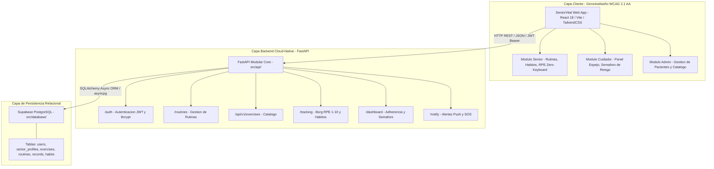

# Intelligent Wellness Platform — SeniorVital

> **Plataforma de Salud y Bienestar para Adultos Mayores (+60)**  
> **Maestría en Tecnologías de Información y Comunicación**  
> **La Universidad del Zulia (LUZ) — Maracaibo, Venezuela**  
> **Docente Titular:** Dra. Yaskelly Yedra  
> **Equipo (Team 5):** Daniel Alejandro Sánchez Ávila & Abdenago Nahmens  

[](https://github.com/YaskCode-laboratory/wellness-platform-team5/actions)
[](https://fastapi.tiangolo.com)
[](https://www.python.org/)
[](https://react.dev/)
[](https://supabase.com/)
[](https://aistudio.google.com/)
[](https://openrouter.ai/)
[](https://seniorvital-backend.onrender.com)
[](https://www.w3.org/TR/WCAG21/)
[](LICENSE)

---

## Descripción

**SeniorVital** es una solución integral de salud digital (*HealthTech / Silver Economy*) diseñada para preservar la autonomía motriz, mitigar la sarcopenia y prevenir el deterioro funcional en adultos mayores de 60 años. 

La plataforma facilita la gestión y ejecución de rutinas de actividad física adaptadas (fuerza, equilibrio, movilidad y flexibilidad), el registro del esfuerzo percibido mediante la escala de Borg (RPE 1-10) con una interfaz *Zero-Keyboard*, y la supervisión remota no invasiva mediante un panel de control con semáforo de riesgo para cuidadores y familiares.

---

## Objetivos

### Objetivo General
Desarrollar, desplegar y evaluar una plataforma web cloud-native orientada al bienestar gerontológico que permita la prescripción adaptativa de ejercicios, el seguimiento de hábitos saludables y la supervisión remota de adultos mayores, cumpliendo con los estándares de calidad de software ISO/IEC 25010 y accesibilidad universal WCAG 2.1 AA.

### Objetivos Específicos
1. **Modelar la Gestión de Usuarios y Perfiles Clínicos:** Implementar autenticación segura basada en roles (RBAC) con tokens JWT y perfiles gerontológicos con condiciones crónicas y nivel de autonomía motriz.
2. **Gestionar el Catálogo y Rutinas de Movilidad:** Proveer un catálogo estructurado de ejercicios geriátricos con recursos multimedia y planes de dosificación física diaria.
3. **Monitorear el Esfuerzo Físico y Hábitos:** Registrar la percepción de fatiga (Borg RPE) y síntomas articulares post-ejercicio, así como la ingesta de agua y horas de sueño.
4. **Habilitar Supervisión Familiar y Alertas SOS:** Diseñar un portal de solo lectura (*Modo Espejo*) con semáforo de alerta clínica y despacho de notificaciones push de emergencia.
5. **Garantizar Accesibilidad Gerontológica (WCAG 2.1 AA):** Crear una interfaz táctil accesible con botones gigantes ($\ge 48\times 48\text{ px}$), alto contraste cromático y navegación intuitiva.

---

## Arquitectura general

La plataforma implementa una arquitectura **Monolito Modular Asíncrono** construida con **FastAPI** y desacoplada de la capa cliente en **React (SPA)**, con persistencia relacional en la nube.


```mermaid
flowchart TD
    subgraph Client_Layer [Capa Cliente - Gerontodiseño WCAG 2.1 AA]
        UI[SeniorVital Web App - React 18 / Vite / TailwindCSS]
        UI_Senior[Modulo Senior - Rutinas, Habitos, RPE Zero-Keyboard]
        UI_Caregiver[Modulo Cuidador - Panel Espejo, Semaforo de Riesgo]
        UI_Admin[Modulo Admin - Gestion de Pacientes y Catalogo]
        
        UI --> UI_Senior
        UI --> UI_Caregiver
        UI --> UI_Admin
    end

    subgraph Backend_Layer [Capa Backend Cloud-Native - FastAPI]
        API[FastAPI Modular Core - src/api/]
        Router_Auth["/auth - Autenticacion JWT y Bcrypt"]
        Router_Routines["/routines - Gestion de Rutinas"]
        Router_Exercises["/api/v1/exercises - Catalogo"]
        Router_Tracking["/tracking - Borg RPE 1-10 y Habitos"]
        Router_Dashboard["/dashboard - Adherencia y Semaforo"]
        Router_Notify["/notify - Alertas Push y SOS"]
        
        API --> Router_Auth
        API --> Router_Routines
        API --> Router_Exercises
        API --> Router_Tracking
        API --> Router_Dashboard
        API --> Router_Notify
    end

    subgraph Persistence_Layer [Capa de Persistencia Relacional]
        DB_Engine[Supabase PostgreSQL - src/database/]
        Tables[Tablas: users, senior_profiles, exercises, routines, records, habits]
        DB_Engine --- Tables
    end

    UI -->|HTTP REST / JSON / JWT Bearer| API
    API -->|SQLAlchemy Async ORM / asyncpg| DB_Engine
```

---

## Tecnologías utilizadas

* **Backend & API:** Python 3.11+, FastAPI (ASGI Framework), Pydantic v2, Uvicorn.
* **Base de Datos & Persistencia:** PostgreSQL 15 (Supabase Cloud), SQLAlchemy 2.0 ORM, conectores asíncronos (`asyncpg`, `psycopg2-binary`).
* **Seguridad & Criptografía:** JWT (JSON Web Tokens con firma HMAC-SHA256 vía `python-jose`), Passlib con algoritmo `Bcrypt`.
* **Frontend & UX:** React 18, Vite, Tailwind CSS, Lucide Icons, Google Material Symbols.
* **Accesibilidad & Calidad:** Estándares WCAG 2.1 AA, Modelo de Calidad ISO/IEC 25010.
* **DevOps & Containerización:** Docker, Docker Compose, Render.com Web Services, GitHub Actions (CI/CD).

---

## Estructura del repositorio

```text
wellness-platform-team5/
├── docs/
│   ├── architecture/
│   │   ├── cloud-architecture.md          # Arquitectura de despliegue en la nube y persistencia
│   │   ├── data-architecture.md           # Modelo relacional y diccionario de datos
│   │   └── system-overview.md             # Visión general del sistema y diagramas UML
│   ├── project/
│   │   ├── scope.md                       # Alcance detallado del MVP
│   │   └── team.md                        # Información de los autores y dirección académica
│   └── requirements/
│       ├── functional-requirements.md     # Requisitos funcionales (RF-01 a RF-10)
│       ├── non-functional-requirements.md # Requisitos no funcionales (ISO 25010 y WCAG 2.1 AA)
│       ├── use-cases.md                  # Especificación de casos de uso (CU-01 a CU-08)
│       └── user-stories.md               # Historias de usuario en formato Gherkin
├── src/
│   ├── api/                               # Routers y controladores RESTful FastAPI
│   │   ├── main.py                        # Punto de entrada de la aplicación FastAPI
│   │   ├── config.py                      # Configuración y variables de entorno
│   │   ├── auth.py                        # Router de autenticación y roles
│   │   ├── routines.py                    # Router de rutinas y prescripción
│   │   ├── exercises.py                   # Router del catálogo de ejercicios
│   │   ├── tracking.py                    # Router de esfuerzo RPE y hábitos
│   │   ├── dashboard.py                   # Router de analítica y semáforo de riesgo
│   │   ├── notify.py                      # Router de notificaciones y botón SOS
│   │   └── chat.py                        # Router de interacción conversacional base
│   ├── app/                               # Código fuente del Frontend (React + Vite)
│   │   ├── src/                           # Componentes, vistas y lógica cliente
│   │   ├── index.html                     # Plantilla HTML principal
│   │   ├── package.json                   # Dependencias y scripts de Vite
│   │   ├── tailwind.config.js             # Tokens de diseño y paleta accesible
│   │   └── vite.config.js                 # Configuración de empaquetado
│   ├── database/                          # Conexión ORM y modelos de base de datos
│   │   ├── database.py                    # Sesión y motor SQLAlchemy
│   │   ├── models.py                      # Modelos relacionales de entidades
│   │   └── schemas.py                     # Esquemas de validación Pydantic
│   └── services/                          # Lógica de servicios de negocio
├── .env.example                           # Plantilla de variables de entorno saneada
├── Dockerfile                             # Definición de contenedor Docker de producción
├── README.md                              # Documentación principal del repositorio
└── requirements.txt                       # Dependencias de Python
```

---

## Instalación y ejecución

### 1. Prerrequisitos
* Python 3.11 o superior instalado.
* Node.js 18+ y npm instalados.
* Acceso a una instancia de PostgreSQL (o Supabase).

### 2. Configuración del Backend (FastAPI)
```bash
# 1. Crear entorno virtual
python -m venv venv
source venv/bin/activate  # En Windows: venv\Scripts\activate

# 2. Instalar dependencias
pip install -r requirements.txt

# 3. Configurar variables de entorno
cp .env.example .env
# Configurar DATABASE_URL y SECRET_KEY en el archivo .env

# 4. Iniciar el servidor backend
uvicorn src.api.main:app --reload --port 8000
```
La documentación interactiva Swagger UI estará disponible en `http://localhost:8000/docs`.

### 3. Configuración del Frontend (React + Vite)
```bash
# 1. Navegar al directorio del frontend
cd src/app

# 2. Instalar dependencias de Node
npm install

# 3. Iniciar el servidor de desarrollo
npm run dev
```
La aplicación web estará disponible en `http://localhost:5173`.

---

## Equipo

* **Daniel Alejandro Sánchez Ávila** — *Investigador y Desarrollador Backend / DevOps*
* **Abdenago Nahmens** — *Investigador y Desarrollador Frontend / UX-UI*
* **Dra. Yaskelly Yedra** — *Tutor Académico y Docente Titular de la Asignatura*

---

## Estado del proyecto

* **Fase Actual:** Línea Base Funcional (MVP Transaccional Pre-IA).
* **Materia de Origen:** Ingeniería de Software y Base de Datos (Completada y Aprobada al 100%).
* **Próxima Fase:** Evolución hacia Sistema Inteligente Multi-Agente con Generación Aumentada por Recuperación (RAG) y Orquestación Jerárquica para la materia *Sistemas Inteligentes*.
