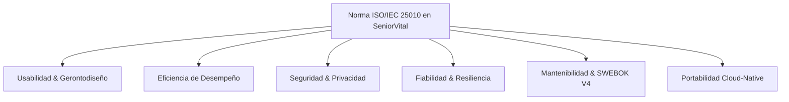

# 📋 Especificaciones Funcionales y No Funcionales — SeniorVital
**Plataforma Inteligente de Gestión Wellness Gerontológica**  
*Cumplimiento Estricto: SWEBOK V4 & Norma de Calidad ISO/IEC 25010*

---

## 1. Visión General y Alcance del Sistema
SeniorVital es una plataforma de salud digital (*HealthTech / Silver Economy*) diseñada para acompañar a personas mayores de 60 años en su actividad física, prevención de sarcopenia y adherencia a hábitos saludables. El sistema integra un ecosistema de agentes inteligentes de IA, memoria semántica basada en *Retrieval-Augmented Generation* (RAG) con `pgvector` sobre Supabase PostgreSQL, e interfaces adaptadas a principios de gerontodiseño y accesibilidad universal.

---

## 2. Requisitos Funcionales (RF) — Especificación Formal

### 2.1 Módulo de Gestión de Identidad y Perfiles Clínicos (`/auth`)
* **RF-AUTH-01 (Registro y Roles):** El sistema debe permitir el registro de usuarios asignando estrictamente uno de los tres roles definidos: `senior` (adulto mayor), `caregiver` (cuidador familiar) o `admin` (fisioterapeuta / administrador clínico).
* **RF-AUTH-02 (Seguridad Criptográfica):** Las contraseñas deben ser hasheadas con algoritmo *Bcrypt* con factor de trabajo adecuado antes de su almacenamiento en la base de datos.
* **RF-AUTH-03 (Perfil de Salud Geriátrico):** Los usuarios de rol `senior` deben contar con un perfil de salud estructurado que incluya edad, peso, altura, nivel de condición física (1 a 3), condiciones médicas (hipertensión, osteoporosis, artrosis, etc.), objetivos y equipamiento disponible.
* **RF-AUTH-04 (Autenticación JWT):** El login debe emitir un token JWT firmado (*HS256*) con expiración configurable, permitiendo autenticación *Stateless*.
* **RF-AUTH-05 (Vinculación Senior-Cuidador):** Un cuidador puede vincularse a un adulto mayor para acceder a su vista de seguimiento no invasiva.

### 2.2 Módulo de Catálogo Clínico de Ejercicios (`/api/v1/exercises`)
* **RF-CAT-01 (Biblioteca de Progresión):** El catálogo debe clasificar los ejercicios en 4 niveles de progresión geriátrica (Nivel 1: Movilidad articular sentada, Nivel 2: Fuerza isométrica asistida, Nivel 3: Equilibrio dinámico, Nivel 4: Funcional avanzado).
* **RF-CAT-02 (Filtro por Contraindicaciones):** La consulta de ejercicios debe permitir filtrar o excluir dinámicamente aquellos ejercicios que coincidan con las restricciones médicas del paciente (ej. evitar flexión profunda en gonartrosis).
* **RF-CAT-03 (Multimedia y Guía):** Cada ejercicio debe contener descripción paso a paso, grupos musculares objetivo y enlace a recurso visual/video.

### 2.3 Módulo de Generación Inteligente de Rutinas (`/routines`)
* **RF-ROUT-01 (Prescripción Personalizada con IA):** El agente *Wellness Coach* debe prescribir diariamente una rutina adaptada a la edad, condición y fatiga histórica del adulto mayor.
* **RF-ROUT-02 (Estructura Clínica Obligatoria):** Toda rutina generada debe incluir fase de *Calentamiento articular* (`warmup`), fase de *Ejercicios principales* (`exercises` con series, repeticiones y tiempo) y recomendaciones de hidratación.
* **RF-ROUT-03 (Idempotencia Diaria):** Si el usuario ya cuenta con una rutina generada en la fecha actual, el sistema retornará la rutina existente a menos que se fuerce explícitamente (`force=True`).

### 2.4 Módulo de Interacción Conversacional RAG (`/api/v1/chat`)
* **RF-CHAT-01 (Agente Wellness Empático):** El agente conversacional debe responder dudas sobre ejercicios, dolor o bienestar con tono cálido, empático y terminología clara.
* **RF-CHAT-02 (Memoria Semántica RAG):** El agente debe consultar la base de conocimiento gerontológico vectorial mediante similitud coseno (`pgvector`) para fundamentar sus respuestas.
* **RF-CHAT-03 (Guardrails Determinísticos):** Toda respuesta generada por el LLM debe pasar por una capa de seguridad clínica en Python puro que filtre recomendaciones farmacológicas no autorizadas o ejercicios de alto impacto lesivos.

### 2.5 Módulo de Registro de Esfuerzo y Analítica Preventiva (`/tracking`)
* **RF-TRK-01 (Escala de Esfuerzo Percibido RPE 1-10):** El sistema debe registrar la intensidad subjetiva tras cada sesión usando la escala Borg/RPE (1: Muy suave a 10: Esfuerzo máximo).
* **RF-TRK-02 (Reporte Articular):** El usuario debe poder reportar si sintió dolor o molestia en articulaciones específicas (rodilla, cadera, hombro, espalda).
* **RF-TRK-03 (Detección de Fatiga Crítica):** Si un adulto mayor registra un RPE $\ge 8$ en dos sesiones continuas o reporta dolor articular agudo, el agente preventivo debe ajustar automáticamente la dificultad a la baja y notificar al cuidador.

---

## 3. Requisitos No Funcionales (RNF) — Norma ISO/IEC 25010

### 3.1 Usabilidad y Gerontodiseño (WCAG 2.1 Nivel AA)
* **RNF-USAB-01 (Accesibilidad Táctil):** Todo botón o elemento interactivo debe tener un área táctil mínima de $48 \times 48\,\text{px}$ (recomendado $56\text{px}$).
* **RNF-USAB-02 (Contraste y Tipografía):** Contraste de color mínimo de $4.5:1$ en texto normal y $3:1$ en texto grande. Tipografías legibles (*Inter*, *Lexend*) con tamaño base $\ge 18\,\text{px}$.
* **RNF-USAB-03 (Diseño No Punitivo):** El sistema no debe penalizar la pérdida de rachas; el calendario y mensajes deben enfocarse en refuerzo positivo y metas de autocuidado.

### 3.2 Eficiencia de Desempeño
* **RNF-PERF-01 (Tiempo de Respuesta API):** Los endpoints transaccionales (auth, catálogo, tracking) deben responder en un tiempo $t < 200\,\text{ms}$ en el percentil 95 ($P_{95}$).
* **RNF-PERF-02 (Latencia de Inferencia IA):** La generación de rutinas y respuestas de chat con Google AI Studio (`gemini-3.6-flash`) debe completarse en $t < 2.0\,\text{s}$.
* **RNF-PERF-03 (Caché SWR Frontend):** El frontend debe implementar *Stale-While-Revalidate* en memoria para transiciones instantáneas ($0\,\text{ms}$) entre pantallas ya visitadas.

### 3.3 Seguridad y Confidencialidad
* **RNF-SEC-01 (Cero Secretos Quemados):** Ninguna credencial, llave de API (`GEMINI_API_KEY`, `OPENROUTER_API_KEY`) ni URL de base de datos debe residir en el código fuente.
* **RNF-SEC-02 (Protección de Datos Sanitarios):** La base de datos en Supabase PostgreSQL debe comunicarse mediante conexiones cifradas TLS/SSL (`sslmode=require`).
* **RNF-SEC-03 (Control de Acceso Basado en Roles - RBAC):** Los endpoints clínicos de auditoría y ajuste manual solo son accesibles con credenciales de rol `admin`.

### 3.4 Fiabilidad, Resiliencia y Disponibilidad
* **RNF-REL-01 (Alta Disponibilidad Híbrida):** El subsistema de IA implementa conmutación de tres niveles:
  1. *Nivel Primario:* Google AI Studio (`gemini-3.6-flash`).
  2. *Nivel Secundario:* OpenRouter Multi-Model (`gemma-4-31b-it`, `llama-3.3-70b`, `mistral-7b`).
  3. *Nivel de Respaldo Clínico:* Generador determinístico de rutina segura ante corte total de red.
* **RNF-REL-02 (Tolerancia a Fallos):** Si la base de datos o el backend experimentan un arranque en frío, el frontend debe mantener una interfaz no bloqueante con fallback inmediato.

### 3.5 Mantenibilidad (SWEBOK V4)
* **RNF-MAN-01 (Monolito Modular):** El código debe estar desacoplado en capas limpias (`routers`, `models`, `schemas`, `agents`, `tools`) facilitando su evolución independiente o migración a microservicios.
* **RNF-MAN-02 (Tipado Fuerte):** 100% de los endpoints y entidades deben estar validados con *Pydantic V2* y tipado estricto de Python 3.11+.

### 3.6 Portabilidad y Despliegue Cloud-Native
* **RNF-PORT-01 (Contenerización Docker):** La aplicación debe ejecutarse en cualquier entorno mediante un `Dockerfile` ligero basado en `python:3.11-slim`.
* **RNF-PORT-02 (Render.com Compliance):** El servidor `uvicorn` debe enlazar dinámicamente al puerto asignado por la variable de entorno `$PORT` (`0.0.0.0:$PORT`).
