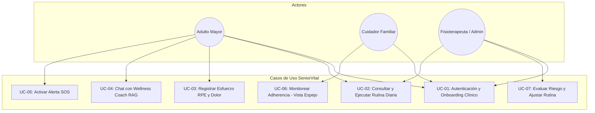

# 📑 Product Backlog y Casos de Uso del Sistema — SeniorVital
**Gestión Ágil de Requisitos y Modelado del Comportamiento**  
*Formato: Épicas, Historias de Usuario con Criterios de Aceptación (Gherkin) y Casos de Uso Formales*

---

## 1. Product Backlog Priorizado (Scrum / Kanban)

| ID | Épica | Historia de Usuario | Prioridad (MoSCoW) | Estimación (SP) | Estado |
| :--- | :--- | :--- | :---: | :---: | :---: |
| **US-01** | Onboarding & Auth | Como adulto mayor, quiero ingresar con 1 toque o completar un formulario clínico guiado de 5 pasos para personalizar mis ejercicios. | **Must Have** | 5 | ✅ Completado |
| **US-02** | Prescripción AI | Como adulto mayor, quiero recibir cada mañana una rutina adaptada a mis dolores para ejercitarme con seguridad sin lesionarme. | **Must Have** | 8 | ✅ Completado |
| **US-03** | Registro RPE & Dolor | Como adulto mayor, quiero calificar la intensidad del 1 al 10 e indicar si me dolió una articulación para que mi plan se ajuste. | **Must Have** | 5 | ✅ Completado |
| **US-04** | Seguimiento Cuidador | Como cuidador familiar, quiero ver un resumen semanal no invasivo de la actividad de mi familiar para estar tranquilo. | **Should Have** | 5 | ✅ Completado |
| **US-05** | Panel Clínico / Physio | Como fisioterapeuta, quiero ver el semáforo de riesgo por IA (Verde/Ámbar/Rojo) y poder ajustar manualmente una rutina. | **Should Have** | 8 | ✅ Completado |
| **US-06** | Chat Wellness RAG | Como usuario, quiero hacer preguntas al asistente sobre cómo hacer un movimiento para recibir orientación clínica segura. | **Could Have** | 5 | ✅ Completado |
| **US-07** | Alerta SOS Rápida | Como adulto mayor, quiero un botón de emergencia flotante con confirmación en 2 pasos para pedir ayuda sin falsas alarmas. | **Must Have** | 3 | ✅ Completado |

---

## 2. Historias de Usuario Detalladas con Criterios de Aceptación (Gherkin)

### US-02: Generación Inteligente de Rutina Diaria
> **Como** adulto mayor con hipertensión y artrosis leve,  
> **Quiero** que el sistema consulte mi perfil médico y me genere una rutina sin movimientos de impacto,  
> **Para** mantenerme activo sin riesgo de lesiones articulares ni sobreesfuerzo cardiovascular.

```gherkin
Escenario: Generación exitosa de rutina diaria con Google AI Studio
  Dado que el usuario "Manuel" tiene 72 años y restricción de "artrosis de rodilla"
  Cuando el usuario abre la pantalla principal por primera vez en el día
  Entonces el agente Wellness Coach consulta la base de datos vectorial
  Y genera una rutina en formato JSON con fase de calentamiento articular y ejercicios sentados
  Y la rutina queda persistida en PostgreSQL con estado "PENDING".

Escenario: Conmutación por rate-limit en la nube
  Dado que el servicio de IA externo responde con código 429 (Rate Limit)
  Cuando el sistema intenta generar la rutina
  Entonces conmuta automáticamente al siguiente modelo de respaldo o entrega la Rutina Preventiva Calibrada
  Y el usuario visualiza su rutina en menos de 2 segundos sin recibir mensajes de error.
```

---

### US-03: Registro de Esfuerzo Percibido (RPE) y Dolor
> **Como** adulto mayor al finalizar un ejercicio,  
> **Quiero** seleccionar con botones grandes cómo sentí el esfuerzo del 1 al 10 y marcar si tuve dolor articular,  
> **Para** que el sistema calibre automáticamente los ejercicios futuros.

```gherkin
Escenario: Calificación de intensidad adecuada (RPE 3 a 6)
  Dado que el usuario terminó la serie de "Marcha Estática"
  Cuando presiona el botón "5" en la botonera táctil RPE y selecciona "Sin Dolor"
  Entonces el sistema registra el evento con éxito
  Y actualiza el indicador de adherencia semanal en color Verde Salvia.

Escenario: Detección preventiva de dolor o fatiga severa (RPE 9-10)
  Dado que el usuario marca una intensidad de "9" (Muy Duro) y reporta molestia en "Rodilla"
  Cuando presiona "Guardar y Registrar Esfuerzo"
  Entonces el sistema registra el evento con bandera de atención
  Y el agente preventivo programa una reducción de series para el día siguiente
  Y se emite una notificación de advertencia visible en el panel del fisioterapeuta.
```

---

## 3. Especificación Formal de Casos de Uso (UML)



### Especificación Textual de Casos de Uso Clave

#### Caso de Uso UC-02: Consultar y Ejecutar Rutina Diaria
* **Actor Principal:** Adulto Mayor (`senior`).
* **Precondición:** Usuario autenticado con perfil de salud registrado.
* **Flujo Principal:**
  1. El usuario accede a la pantalla de inicio (*Home*).
  2. El sistema verifica si existe una rutina para la fecha actual.
  3. Si no existe, invoca al agente *Wellness Coach* para construirla basándose en el perfil geriátrico.
  4. La interfaz renderiza las tarjetas de ejercicios con repeticiones, tiempo y video guía.
  5. El usuario ejecuta los ejercicios y avanza al registro de esfuerzo.
* **Flujo Alternativo (Fallo de Red):**
  - Si el backend no responde en 2.5s, el frontend recupera la última rutina en caché (*SWR*) y notifica que opera en modo local.
* **Postcondición:** Rutina disponible para seguimiento y registro.

#### Caso de Uso UC-07: Evaluar Semáforo de Riesgo y Ajustar Rutina
* **Actor Principal:** Fisioterapeuta / Administrador (`admin`).
* **Precondición:** Token de sesión con rol administrativo.
* **Flujo Principal:**
  1. El profesional abre el *Admin Dashboard*.
  2. El sistema calcula la matriz de riesgo basada en eventos de fatiga y adherencia:
     - 🟢 **Bajo Riesgo:** Adherencia $>80\%$, RPE promedio $\le 6$, sin dolor reportado.
     - 🟡 **Riesgo Medio:** Inactividad de 3 a 5 días o RPE 7-8.
     - 🔴 **Alto Riesgo:** Inactividad $>5$ días, RPE 9-10 repetido o dolor articular agudo.
  3. El fisioterapeuta selecciona un paciente y abre la modal de *Ajuste Manual*.
  4. Modifica los ejercicios asignados o reduce repeticiones.
  5. Guarda los cambios, sobreescribiendo la recomendación automática de la IA.
