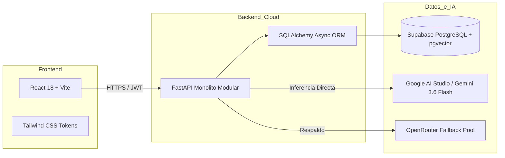

# 📊 Análisis de Mercado y Técnico (FinOps & Arquitectura) — SeniorVital
**Evaluación Estratégica, Benchmark Competitivo y Decisiones de Ingeniería**

---

## 1. Análisis de Mercado y Estado del Arte (*Silver Economy*)

### 1.1 Contexto Demográfico y Oportunidad
El envejecimiento poblacional representa una de las transformaciones demográficas más significativas del siglo XXI. Para 2050, el número de personas mayores de 60 años superará los 2,100 millones a nivel global. El sedentarismo en este segmento conlleva a sarcopenia, pérdida de autonomía y elevados costes sanitarios asociados a caídas.

### 1.2 Benchmark Competitivo

| Plataforma | Enfoque Principal | IA / RAG Adaptativo | Accesibilidad Gerontológica | Visión Cuidador / Physio | Modelo de Costes |
| :--- | :--- | :---: | :---: | :---: | :--- |
| **SilverSneakers GO** | Ejercicio general en casa | ❌ No (rutinas estáticas) | 🟡 Media | ❌ No | Suscripción B2B (Seguros) |
| **Mighty Health** | Coaching metabólico | 🟡 Básico (Reglas) | 🟡 Media | ❌ No | B2C ($15-20 / mes) |
| **Bold Age** | Prevención de caídas | ❌ No | 🟢 Buena | 🟡 Parcial | B2B2C |
| **SeniorVital (Propuesta)** | **Wellness gerontológico integral con IA clínica y RPE adaptativo** | 🟢 **Sí (Multi-Agente + RAG pgvector)** | 🟢 **Excelente (WCAG AA, targets >48px)** | 🟢 **Sí (Vista Espejo + Panel Clínico)** | **Cloud-Native Freemium / B2B2C** |

---

## 2. Decisiones de Arquitectura Técnica y Justificación

### 2.1 Backend: FastAPI + Python 3.11+
* **Justificación:** Alto rendimiento con programación asíncrona nativa (`async`/`await`), generación automática de documentación OpenAPI / Swagger (`/docs`), validación rigurosa de esquemas con Pydantic V2 y compatibilidad nativa con el ecosistema de IA (LangChain, LangGraph).

### 2.2 Base de Datos: Supabase PostgreSQL con Extensión `pgvector`
* **Justificación:** Estabilidad empresarial ACID con soporte nativo de vectores multidimensionales (`vector(384)` con embeddings de *Hugging Face all-MiniLM-L6-v2*). Permite combinar en una sola base de datos transacciones relacionales tradicionales (usuarios, rutinas) y búsquedas semánticas por similitud coseno (*RAG*).

### 2.3 Inferencia de IA: Estrategia Híbrida (Google AI Studio + OpenRouter)
* **Justificación:** 
  - **Google AI Studio (`gemini-3.6-flash`):** Capa principal de alta velocidad (<1s de latencia), cuota gratuita privada de 15 RPM y capacidades avanzadas de razonamiento clínico.
  - **OpenRouter (Pool Gratuito):** Capa secundaria de respaldo multimodelo (`gemma-4-31b-it`, `llama-3.3-70b`) con conmutación automática ante saturación.

---

## 3. Análisis Económico y Estrategia FinOps (Cloud-Native)

### 3.1 Estimación de Costes de Infraestructura (Fase MVP / 1,000 Usuarios Activos)

| Componente | Proveedor / Servicio | Plan / Tier | Coste Mensual ($ USD) |
| :--- | :--- | :--- | :---: |
| **Backend API** | Render.com | Free Web Service (512 MB RAM, 0.1 CPU) | **$0.00** |
| **Frontend Web App** | Vercel / Cloudflare Pages / Render | Free Tier (CDN Global, SSL incluido) | **$0.00** |
| **Base de Datos & pgvector** | Supabase | Free Tier (500 MB DB, 2 vCPU compartido) | **$0.00** |
| **Inferencia LLM** | Google AI Studio | Free Tier (1,500 req/día, 15 RPM) | **$0.00** |
| **Embeddings Semánticos** | Hugging Face (`sentence-transformers`) | Local / In-Process (CPU) | **$0.00** |
| **Dominio y DNS** | Cloudflare DNS | Free Tier | **$0.00** |
| **TOTAL MENSUAL ESTIMADO (MVP)** | — | — | **$0.00 / mes** |

### 3.2 Estrategia de Escalado (Fase Comercial / >10,000 Usuarios)
* **Render Individual Instance (Starter):** $7/mes (elimina cold start y amplía memoria a 1 GB).
* **Supabase Pro Tier:** $25/mes (8 GB almacenamiento, backups continuos).
* **Google Gemini Pay-as-you-go:** $0.075 por 1M tokens de entrada (~$15/mes para 10k rutinas diarias).
* **Coste total de operación a escala:** < $50 USD / mes para sostener más de 10,000 adultos mayores activos.
