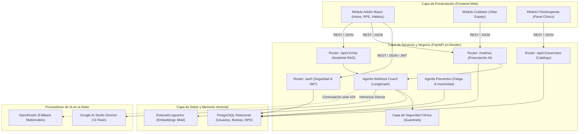
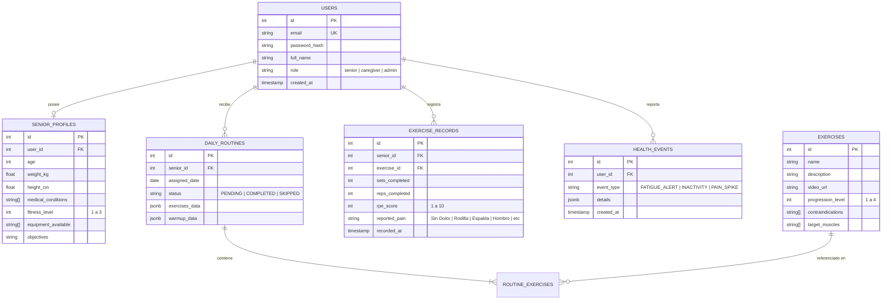
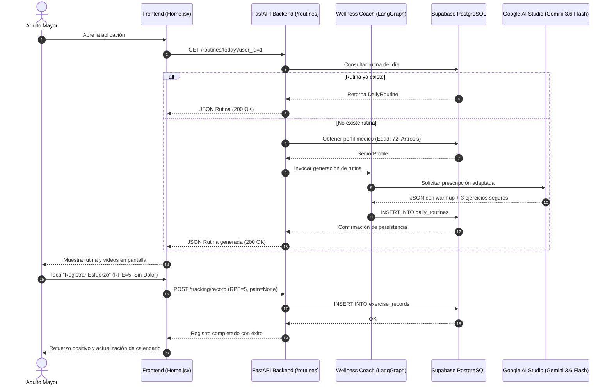

# 📐 Modelado Arquitectónico y Diagramas UML — SeniorVital
**Documentación Viva como Código (*Markdown as-Code con Mermaid.js*)**

---

## 1. Diagrama de Arquitectura de Componentes (C4 Nivel 2)

---

## 2. Diagrama Entidad-Relación (ERD de Base de Datos)

---

## 3. Diagrama de Secuencia: Prescripción Inteligente y Registro RPE

