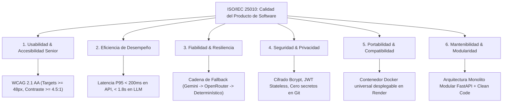

# 📋 Sprint 1: Especificaciones de Requisitos y Calidad del Software (ISO/IEC 25010)

**Materia:** Ingeniería de Software y Base de Datos  
**Docente:** Dra. Yaskelly Yedra  
**Autores:** Daniel Alejandro Sánchez Ávila & Abdenago Nahmens  
**Proyecto:** SeniorVital — Ecosistema Inteligente de Bienestar Gerontológico  
**Estándares de Referencia:** SWEBOK v4, ISO/IEC 25010, WCAG 2.1 AA  

---

## 🎯 1. Propósito y Alcance del Sistema
**SeniorVital** es una plataforma tecnológica *HealthTech / Silver Economy* diseñada para promover la autonomía, mitigar la sarcopenia y prevenir el deterioro funcional en adultos mayores de 60 años mediante prescripción adaptativa de ejercicios, registro de fatiga mediante la escala de percepción del esfuerzo (Borg RPE) y acompañamiento conversacional seguro con agentes de Inteligencia Artificial.

---

## 📌 2. Requisitos Funcionales (RF)

| Código | Módulo | Requisito Funcional | Prioridad (MoSCoW) | Criterio de Aceptación |
| :--- | :--- | :--- | :---: | :--- |
| **RF-01** | **Autenticación & RBAC** | El sistema debe permitir el registro e inicio de sesión de usuarios categorizados por roles (*Senior*, *Caregiver*, *Admin/Fisioterapeuta*) mediante tokens JWT y contraseñas hasheadas con Bcrypt. | **Must Have** | Registro en `/auth/register` (HTTP 201) y login en `/auth/login` (HTTP 200) con emisión de token JWT y claims de rol. |
| **RF-02** | **Perfil Gerontológico** | Al registrar un adulto mayor, el sistema debe inicializar automáticamente un perfil clínico con nivel de condición física base, patologías y preferencias. | **Must Have** | Creación en tabla `senior_profiles` con clave foránea hacia `users.id`. |
| **RF-03** | **Catálogo de Ejercicios** | El sistema debe proveer un catálogo de ejercicios adaptados (fuerza isométrica, movilidad articular, equilibrio y flexibilidad) con recursos multimedia demostrativos. | **Must Have** | `GET /api/v1/exercises/` y `GET /catalog/exercises` retornan catálogo estructurado en formato JSON. |
| **RF-04** | **Prescripción de Rutina con IA** | El sistema debe prescribir diariamente una rutina de 3 a 5 ejercicios adaptados al nivel de condición física y al historial de fatiga del adulto mayor mediante IA generativa. | **Must Have** | `POST /routines/generate` invoca al agente de IA y devuelve rutina con `routine_id`, lista de ejercicios y series/repeticiones. |
| **RF-05** | **Consulta de Rutina Diaria** | El usuario debe poder consultar su rutina del día, tolerando identificadores numéricos y UUIDs sintéticos generados por el cliente frontend. | **Must Have** | `GET /routines/today?user_id={id}` devuelve la rutina del día o estado `pending` si aún no ha iniciado. |
| **RF-06** | **Registro de Esfuerzo (Borg RPE)** | El adulto mayor debe registrar la finalización de cada ejercicio ingresando la escala Borg RPE (1 al 10) y síntomas de dolor articular. | **Must Have** | `POST /tracking/record` almacena el registro en `exercise_records` y evalúa fatiga clínica. |
| **RF-07** | **Acompañamiento Conversacional (Coach)** | El sistema debe ofrecer un chat conversacional empático (*Wellness Coach*) con guardrails de seguridad médica que rechace consultas de diagnóstico farmacológico o urgencias agudas. | **Must Have** | `POST /api/v1/chat` filtra consultas de emergencia y responde con consejos gerontológicos basados en evidencia. |
| **RF-08** | **Registro de Hábitos Diarios** | El sistema debe permitir el registro de ingesta de agua (vasos) y horas de sueño para evaluación holística del bienestar. | **Should Have** | `POST /tracking/habits` y `GET /tracking/habits/{user_id}/{date}` gestionan el balance hídrico y descanso. |
| **RF-09** | **Dashboard y Proyección Funcional** | El sistema debe calcular el índice de adherencia semanal y generar proyecciones funcionales de fuerza/movilidad a 4 semanas. | **Should Have** | `GET /dashboard/progress/{user_id}` y `GET /dashboard/projection/{user_id}` devuelven analíticas del paciente. |
| **RF-10** | **Semáforo Clínico para Cuidadores** | Los cuidadores deben disponer de una matriz visual con semáforo de riesgo (Verde: adherencia óptima, Ámbar: fatiga moderada RPE $\ge 7$, Rojo: dolor reportado o inactividad $>3$ días). | **Must Have** | `GET /dashboard/residents` retorna lista de adultos mayores asignados con estado clínico consolidado. |
| **RF-11** | **Alertas y Notificaciones SOS** | El sistema debe emitir alertas push y despachar eventos de emergencia ante reporte de dolor articular severo o activación de botón SOS. | **Must Have** | `POST /notify/send` distribuye la alerta al cuidador o familiar enlazado. |
| **RF-12** | **Búsqueda Semántica de Ejercicios** | El sistema debe permitir la recuperación de ejercicios similares por descripción textual mediante embeddings vectoriales de 384 dimensiones. | **Could Have** | Función vectorial `match_exercises` sobre la extensión `pgvector` en Supabase. |

---

## 🛡️ 3. Requisitos No Funcionales (RNF) — Modelo de Calidad ISO/IEC 25010

### 3.1 Usabilidad (Accesibilidad Gerontológica WCAG 2.1 AA)
* **RNF-01 (Áreas de Contacto Táctil):** Todo botón interactivo en la interfaz debe tener un tamaño mínimo de **$48 \times 48\text{ px}$** y un espaciado inter-elemento $\ge 12\text{ px}$ para evitar pulsaciones erróneas por temblor senil o artritis.
* **RNF-02 (Contraste Cromático y Legibilidad):** La tipografía debe emplear fuentes de trazo limpio (*Inter*, *Roboto*) con tamaño base $\ge 18\text{ px}$ y un ratio de contraste de color mínimo de **$4.5:1$** en texto normal y **$7:1$** en texto grande sobre fondos oscuros o claros.
* **RNF-03 (Cognición y Carga Mental):** El flujo de interacción debe ser lineal (*One-Action-at-a-Time*), evitando modales anidados y empleando lenguaje empático, claro y libre de tecnicismos médicos alarmistas.

### 3.2 Eficiencia de Desempeño
* **RNF-04 (Latencia de la API):** El 95% de las peticiones HTTP convencionales (`GET`, `POST`) deben resolverse en un tiempo **$P_{95} < 200\text{ ms}$**.
* **RNF-05 (Tiempo de Inferencia IA):** La generación de rutinas adaptadas con IA mediante Google AI Studio (`gemini-3.6-flash`) no debe exceder **$1.8\text{ segundos}$**.

### 3.3 Fiabilidad y Tolerancia a Fallos
* **RNF-06 (Estrategia Multi-Nivel de Fallback):** Ante errores de cuota (HTTP 429), saturación (HTTP 503) o caída de red en Google AI Studio, el sistema debe redirigir la inferencia automáticamente a **OpenRouter** (`openrouter/free`, `google/gemma-4-31b-it:free`) y, en caso extremo, generar una rutina clínica determinística sin interrumpir el servicio al usuario.
* **RNF-07 (Arranque No Bloqueante en Cloud):** El proceso de inicialización de esquemas en la base de datos debe ejecutarse de manera asíncrona no bloqueante para garantizar que el servidor web abra el puerto HTTP asignado por Render en **$< 1.0\text{ segundo}$** evitando *port scan timeouts*.

### 3.4 Seguridad
* **RNF-08 (Protección Criptográfica):** Las contraseñas se almacenan mediante el algoritmo `Bcrypt` con salt dinámico y límite estricto de 72 bytes.
* **RNF-09 (Autenticación y Autorización RBAC):** Las sesiones se gestionan mediante tokens **JWT (JSON Web Tokens)** con firma HMAC-SHA256 y expiración configurable. Ningún secreto o API key debe estar codificado en duro en el repositorio.

### 3.5 Mantenibilidad y Portabilidad
* **RNF-10 (Containerización Multiplataforma):** El backend debe empaquetarse en una imagen **Docker** basada en `python:3.11-slim`, garantizando ejecución idéntica tanto en entornos de desarrollo local como en el Web Service de **Render.com**.
