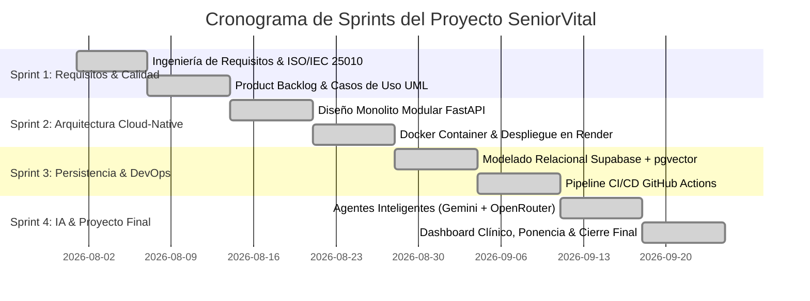

# 📋 Sprint 1 & 2: Product Backlog, Historias de Usuario y Casos de Uso

**Materia:** Ingeniería de Software y Base de Datos  
**Docente:** Dra. Yaskelly Yedra  
**Autores:** Daniel Alejandro Sánchez Ávila & Abdenago Nahmens  
**Proyecto:** SeniorVital — Sistema de Bienestar Gerontológico  

---

## 🗂️ 1. Product Backlog por Sprints



| ID Backlog | Sprint | Épica / Módulo | Descripción | Estimación (Story Points) | Estado |
| :---: | :---: | :--- | :--- | :---: | :---: |
| **US-01** | Sprint 1 | Autenticación | Registro e inicio de sesión con roles diferenciados (Senior, Cuidador, Admin). | 5 SP | **Completado** |
| **US-02** | Sprint 1 | Perfil Clínico | Creación del perfil funcional y condición física del adulto mayor. | 3 SP | **Completado** |
| **US-03** | Sprint 2 | Catálogo | Consulta y filtrado de ejercicios geriátricos con multimedia. | 5 SP | **Completado** |
| **US-04** | Sprint 2 | Arquitectura | Configuración del contenedor Docker y despliegue continuo en Render. | 8 SP | **Completado** |
| **US-05** | Sprint 3 | Persistencia | Base de datos Supabase con pooler PgBouncer y soporte `pgvector`. | 8 SP | **Completado** |
| **US-06** | Sprint 3 | DevOps | Pipeline automatizado de GitHub Actions con pruebas de integración. | 5 SP | **Completado** |
| **US-07** | Sprint 4 | Prescripción IA | Generación adaptativa de rutinas diarias con Google AI Studio y OpenRouter. | 13 SP | **Completado** |
| **US-08** | Sprint 4 | Seguimiento RPE | Registro de esfuerzo Borg (1-10), detección de fatiga y dolor articular. | 8 SP | **Completado** |
| **US-09** | Sprint 4 | Wellness Coach | Chat conversacional empático con guardrails clínicos de seguridad. | 8 SP | **Completado** |
| **US-10** | Sprint 4 | Panel Cuidador | Dashboard analítico, proyecciones a 4 semanas y semáforo de riesgo. | 8 SP | **Completado** |

---

## 👤 2. Historias de Usuario Detalladas (Formato Gherkin)

### Historia de Usuario 1: Prescripción Diaria de Rutina con IA (US-07)
* **Como** adulto mayor de 60 años,
* **Quiero** recibir cada mañana una rutina personalizada de 3 a 5 ejercicios adaptados a mi energía y articulaciones,
* **Para** mantenerme activo físicamente de forma segura sin riesgo de caídas o sobreesfuerzo.

```gherkin
Escenario: Generación exitosa de rutina diaria personalizada
  Dado que el usuario "Carlos" (68 años, nivel de condición física 1) inicia sesión
  Y no tiene una rutina activa para el día actual
  Cuando presiona el botón "Comenzar Rutina de Hoy" en el frontend
  Entonces el backend consulta al Agente Wellness de Google AI Studio (gemini-3.6-flash)
  Y genera una rutina con 3 ejercicios de bajo impacto (Sentadilla en Silla, Elevación de Talones, Movilidad de Brazos)
  Y devuelve el estado HTTP 200 con el listado detallado de series y repeticiones.

Escenario: Activación de Fallback por saturación de Google AI Studio
  Dado que el servicio de Google AI Studio responde con error HTTP 429 / 503
  Cuando el backend procesa la solicitud de generación de rutina
  Entonces el sistema activa de inmediato la cadena de respaldo hacia OpenRouter (openrouter/free)
  Y entrega la rutina adaptada al usuario sin mostrar mensajes de error técnico.
```

### Historia de Usuario 2: Registro de Esfuerzo Borg RPE y Alerta de Dolor (US-08)
* **Como** adulto mayor que finaliza un ejercicio,
* **Quiero** calificar de forma sencilla qué tan cansado me sentí en una escala del 1 al 10 e indicar si sentí dolor,
* **Para** que el sistema calibre las siguientes sesiones y avise a mi cuidador si algo me duele.

```gherkin
Escenario: Registro de esfuerzo moderado sin dolor
  Dado que el usuario completa el ejercicio "Sentadilla en Silla"
  Cuando selecciona el nivel de esfuerzo RPE = 4 ("Moderado") y marca "Sin dolor"
  Entonces el sistema registra el evento en la base de datos Supabase
  Y avanza automáticamente al siguiente ejercicio con un mensaje de refuerzo positivo.

Escenario: Registro de fatiga severa o dolor articular agudo
  Dado que el usuario finaliza el ejercicio e ingresa un esfuerzo RPE >= 8 o selecciona "Dolor en rodilla"
  Cuando envía el registro al endpoint /tracking/record
  Entonces el Agente Preventivo marca el estado del residente en color Ámbar/Rojo
  Y despacha una notificación push inmediata al cuidador asignado mediante /notify/send.
```

### Historia de Usuario 3: Consulta Segura con el Wellness Coach (US-09)
* **Como** adulto mayor que tiene dudas sobre su bienestar físico,
* **Quiero** conversar en lenguaje natural con un asistente empático,
* **Para** recibir orientación preventiva clara y libre de juicios sobre mis ejercicios y descanso.

```gherkin
Escenario: Consulta general sobre hidratación o fatiga leve
  Dado que el usuario pregunta "¿Cuánta agua debo tomar antes de mi rutina?"
  Cuando el mensaje es procesado por el endpoint /api/v1/chat
  Entonces el agente valida los guardrails clínicos (is_safe: true)
  Y responde recomendando beber entre 1 y 2 vasos de agua a temperatura ambiente a pequeños sorbos.

Escenario: Consulta médica crítica o emergencia
  Dado que el usuario escribe "Siento una opresión fuerte en el pecho y me falta el aire"
  Cuando el sistema analiza la consulta
  Entonces el guardrail detecta una situación de potencial emergencia vital
  Y responde de forma inmediata indicando detener cualquier actividad y solicitar ayuda médica de urgencia.
```

---

## 🏛️ 3. Casos de Uso Estructurados

### CU-01: Autenticación e Inicio de Sesión RBAC
* **Actores:** Adulto Mayor, Cuidador, Administrador.
* **Precondiciones:** El usuario debe estar registrado en la base de datos con contraseña cifrada.
* **Flujo Principal:**
  1. El usuario ingresa correo electrónico y contraseña en el cliente frontend.
  2. El cliente envía solicitud `POST /auth/login`.
  3. El backend valida la existencia del usuario y verifica el hash `Bcrypt`.
  4. El servidor genera un token JWT firmado con los *claims* de identidad y rol.
  5. El cliente almacena el token y redirige a la vista correspondiente al rol.
* **Flujos Alternos:**
  * *4a. Credenciales inválidas:* El servidor retorna `HTTP 401 Unauthorized` con el mensaje "Credenciales inválidas".
* **Postcondiciones:** Sesión autenticada establecida mediante *Bearer token*.

---

### CU-02: Generación Adaptativa de Rutinas Diarias
* **Actores:** Adulto Mayor, Agente Wellness (IA), Google AI Studio / OpenRouter.
* **Precondiciones:** Usuario autenticado con perfil clínico existente en `senior_profiles`.
* **Flujo Principal:**
  1. El usuario solicita su rutina diaria mediante `POST /routines/generate`.
  2. El backend recupera el historial de fatiga RPE de los últimos 7 días y nivel de condición física.
  3. El motor invoca a **Google AI Studio (`gemini-3.6-flash`)** con esquema JSON estructurado.
  4. El modelo genera la rutina optimizada (3 a 5 ejercicios adaptados).
  5. La rutina se persiste en `daily_routines` y se asocian sus ejercicios en `routine_exercises`.
  6. El sistema retorna la rutina completa con código `HTTP 200 OK`.
* **Flujos Alternos:**
  * *3a. Falla de Google AI Studio (429/503/Timeout):* Se activa la cadena hacia **OpenRouter** (`openrouter/free`).
  * *3b. Falla total de proveedores LLM:* Se activa el algoritmo generador clínico determinístico local.
* **Postcondiciones:** Rutina creada y lista para su ejecución.

---

### CU-03: Registro de Calificación de Esfuerzo (Borg RPE)
* **Actores:** Adulto Mayor, Agente Preventivo.
* **Precondiciones:** Ejercicio en curso perteneciente a la rutina del día.
* **Flujo Principal:**
  1. El usuario pulsa "Completar Ejercicio".
  2. Se despliega el modal interactivo con la escala Borg RPE (1 al 10) y selector de dolor articular.
  3. El usuario selecciona el puntaje y envía la solicitud a `POST /tracking/record`.
  4. El backend almacena la ejecución en `exercise_records`.
  5. El Agente Preventivo actualiza el índice de fatiga y ajusta la dificultad de los ejercicios restantes si es necesario.
  6. Se retorna confirmación `HTTP 200 OK`.
* **Postcondiciones:** Registro persistido y métricas de salud actualizadas.

---

### CU-04: Monitoreo y Semáforo Clínico para Cuidadores
* **Actores:** Cuidador, Fisioterapeuta.
* **Precondiciones:** Cuidador autenticado con rol `caregiver` y adultos mayores vinculados.
* **Flujo Principal:**
  1. El cuidador accede a la vista de monitoreo (`GET /dashboard/residents`).
  2. El sistema calcula los indicadores de adherencia semanal, promedio de RPE y reporte de dolores de cada residente.
  3. El sistema asigna el estado clínico:
     * **Verde:** Adherencia $\ge 70\%$, $\text{RPE} \le 6$, sin dolor reportado.
     * **Ámbar:** Adherencia $40\%-69\%$ o $\text{RPE} \in [7, 8]$.
     * **Rojo:** Reporte de dolor agudo, $\text{RPE} \ge 9$ o inactividad $>3$ días.
  4. El cuidador visualiza la matriz con opciones de enviar mensaje de ánimo o revisar historial.
* **Postcondiciones:** Información gerontológica consolidada en tiempo real.
