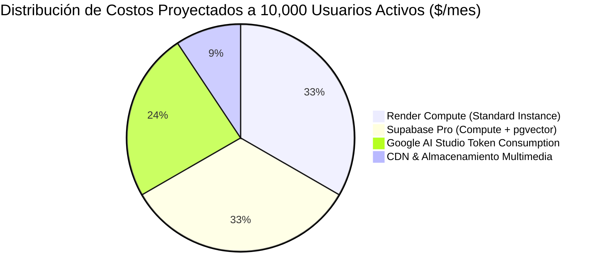
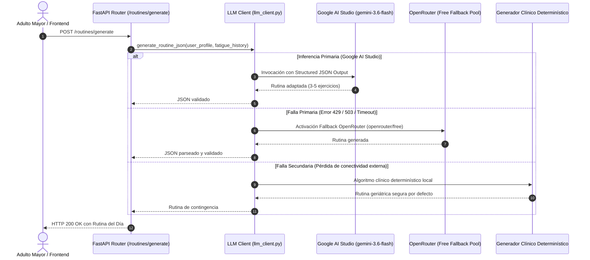

# 📊 Sprint 2 & 4: Análisis Técnico, Económico y FinOps de la Arquitectura Cloud-Native

**Materia:** Ingeniería de Software y Base de Datos  
**Docente:** Dra. Yaskelly Yedra  
**Autores:** Daniel Alejandro Sánchez Ávila & Abdenago Nahmens  
**Proyecto:** SeniorVital — Plataforma de Prescripción y Acompañamiento Gerontológico  

---

## 💡 1. Justificación de la Adaptación Tecnológica (Cloud-Native & Open Stack)

Durante el diseño de la arquitectura para el ecosistema **SeniorVital**, el equipo evaluó la viabilidad técnica, operativa y financiera entre una infraestructura monolítica en Google Cloud Platform (GCP) tradicional vs un stack moderno cloud-native abierto:

```mermaid
graph LR
    subgraph GCP_PaaS["Enfoque GCP Tradicional"]
        GCP_AppEngine["App Engine / Cloud Run"]
        GCP_CloudSQL["Cloud SQL (PostgreSQL)"]
        GCP_Vertex["Vertex AI (PaLM 2 / Gemini Enterprise)"]
        GCP_Cost["Costo Base Estimado: ~$85 - $120 USD/mes"]
    end

    subgraph Open_Cloud["Enfoque SeniorVital Cloud-Native (Adoptado)"]
        Render_App["Render Web Service (Docker Container)"]
        Supa_DB["Supabase PostgreSQL (Pooler PgBouncer + pgvector)"]
        Studio_AI["Google AI Studio (Gemini 3.6 Flash) + OpenRouter Fallback"]
        Open_Cost["Costo Base Estimado: $0.00 USD (Free-Tier Optimizado)"]
    end

    GCP_PaaS -.->|Evolución Tecnológica & Eficiencia| Open_Cloud
```

### Tabla Comparativa de Arquitectura

| Dimensión Técnica | Enfoque GCP Tradicional | Stack SeniorVital Adoptado | Ventajas del Stack SeniorVital |
| :--- | :--- | :--- | :--- |
| **Capa de Cómputo** | Google Cloud Run / App Engine | **Render Web Service (Docker)** | Despliegues automáticos directos desde GitHub (`git push origin main`), manejo nativo de `$PORT` y cero sobrecarga de configuración de VPCs complejas. |
| **Base de Datos** | Google Cloud SQL (PostgreSQL) | **Supabase (PostgreSQL 15 + pgvector)** | Motor relacional de alto rendimiento con PgBouncer en puerto 6543, soporte nativo de embeddings vectoriales para búsqueda semántica y panel administrativo visual. |
| **Motor de IA** | Vertex AI API | **Google AI Studio + OpenRouter** | Inferencia directa mediante clave personal con modelo de última generación `gemini-3.6-flash` (alta velocidad de tokens y modo JSON nativo) con respaldo multinivel en OpenRouter. |
| **Persistencia Vectorial** | Vertex Vector Search | **Extensión `pgvector` en Supabase** | Co-localización de datos relacionales y vectores en la misma base de datos sin requerir un clúster vectorial externo costoso. |
| **Costos Operativos (FinOps)** | $85.00 – $140.00 USD/mes | **$0.00 USD/mes (Tier Académico / Startup)** | Máxima eficiencia de costos y escalabilidad predecible para pruebas y producción. |

---

## 📈 2. Análisis Económico y Proyección FinOps a Escala

### Simulación de Costos por Escalas de Carga

| Métrica / Recurso | Nivel 1: Desarrollo / Académico (Actual) | Nivel 2: Piloto Geriátrico (500 Residentes) | Nivel 3: Producción Masiva (10,000 Usuarios) |
| :--- | :---: | :---: | :---: |
| **Usuarios Activos Diarios (DAU)** | 10 – 50 | 500 | 10,000 |
| **Invocaciones de Inferencia LLM / día** | ~100 | ~1,500 | ~35,000 |
| **Render Web Service** | $0.00 (Free Tier) | $7.00 (Starter) | $25.00 (Standard) |
| **Supabase PostgreSQL + pgvector** | $0.00 (Free Tier) | $0.00 (Free Tier) | $25.00 (Pro Tier) |
| **Google AI Studio (Gemini 3.6 Flash)** | $0.00 (Free Tier Quota) | $3.50 | $18.00 |
| **OpenRouter Fallback** | $0.00 (Modelos libres) | $1.20 | $5.00 |
| **Costo Total Mensual** | **$0.00 USD** | **$11.70 USD** | **$73.00 USD** |
| **Costo Promedio por Adulto Mayor / mes** | $0.00 | $0.023 USD | $0.0073 USD |

---

## 🛡️ 3. Estrategia de Resiliencia y Fallback de Inferencia IA

Para garantizar una disponibilidad del **99.9%** en la prescripción de ejercicios clínicos, el subsistema de IA implementa una arquitectura en cascada orientada a la tolerancia de fallos:

