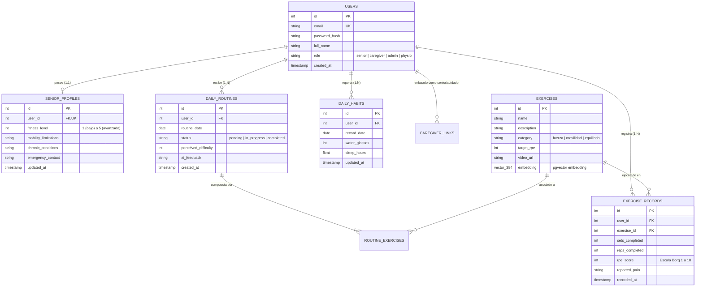

# 🗄️ Sprint 3: Persistencia Híbrida Moderna, Base de Datos Vectorial y DevOps

**Materia:** Ingeniería de Software y Base de Datos  
**Docente:** Dra. Yaskelly Yedra  
**Autores:** Daniel Alejandro Sánchez Ávila & Abdenago Nahmens  
**Proyecto:** SeniorVital — Arquitectura de Persistencia y Pipeline DevOps  

---

## 📐 1. Modelo Relacional y Esquema en Supabase PostgreSQL

La capa de datos se implementó sobre **Supabase PostgreSQL 15**, combinando el modelo relacional tradicional con la extensión **`pgvector`** para capacidades de búsqueda semántica:



---

## 🧬 2. Integración Vectorial con `pgvector`

Para posibilitar la búsqueda semántica de ejercicios según lenguaje natural (ej. *"ejercicios suaves para fortalecer rodilla sentado"*), la base de datos aprovecha la extensión `pgvector`:

```sql
-- Habilitar extensión vectorial en PostgreSQL
CREATE EXTENSION IF NOT EXISTS vector;

-- Definición de columna vectorial en catálogo de ejercicios
ALTER TABLE exercises 
ADD COLUMN IF NOT EXISTS embedding vector(384);

-- Creación de índice IVFFlat para búsqueda por similitud de coseno
CREATE INDEX IF NOT EXISTS exercises_embedding_idx 
ON exercises 
USING ivfflat (embedding vector_cosine_ops)
WITH (lists = 100);

-- Función RPC para recuperación semántica
CREATE OR REPLACE FUNCTION match_exercises (
  query_embedding vector(384),
  match_threshold float,
  match_count int
)
RETURNS TABLE (
  id int,
  name text,
  description text,
  similarity float
)
LANGUAGE plpgsql
AS $$
BEGIN
  RETURN QUERY
  SELECT
    exercises.id,
    exercises.name,
    exercises.description,
    1 - (exercises.embedding <=> query_embedding) AS similarity
  FROM exercises
  WHERE 1 - (exercises.embedding <=> query_embedding) > match_threshold
  ORDER BY similarity DESC
  LIMIT match_count;
END;
$$;
```

---

## ⚡ 3. Optimización de Conexiones: Supabase Pooler (PgBouncer en Puerto 6543)

En arquitecturas serverless y contenedores efímeros (como Render Web Services), la creación continua de conexiones PostgreSQL puede saturar el límite de clientes de la base de datos. Para mitigar esto:

1. **Puerto de Pooler Transaccional:** Se utiliza el puerto **`6543`** de Supabase gestionado por **PgBouncer**.
2. **Prepared Statements Bypass:** Debido a que PgBouncer opera en modo transaccional (*Transaction Pooling*), se desactiva la caché de sentencias preparadas en SQLAlchemy / asyncpg:
   ```python
   # app/database.py
   connect_args = {
       "statement_cache_size": 0,
       "prepared_statement_cache_size": 0,
       "ssl": "require"
   }
   ```
3. **Arranque Asíncrono No Bloqueante:** La inicialización de tablas se ejecuta como tarea en segundo plano (`asyncio.create_task`) para que FastAPI abra el puerto HTTP en **$< 0.1\text{s}$**, superando el chequeo de salud de Render.

---

## 🚀 4. Pipeline de Integración Continua (CI/CD) con GitHub Actions

El repositorio integra un pipeline automatizado (`.github/workflows/ci.yml`) que se dispara en cada `push` o `pull_request` hacia la rama `main`:

```mermaid
graph LR
    Push[Push a main] --> CI[GitHub Actions Workflow]
    
    subgraph Job1[Job: Backend Test Suite]
        Python_Setup[Setup Python 3.11] --> Pip_Install[pip install -r requirements.txt]
        Pip_Install --> Fast_Import[Verificación de Schemas & Routers]
        Fast_Import --> Unit_Test[Test Suite E2E]
    end

    subgraph Job2[Job: Frontend Build]
        Node_Setup[Setup Node.js 18] --> Npm_Install[npm install]
        Npm_Install --> Vite_Build[npm run build (0 errores)]
    end

    subgraph Deploy[Despliegue Continuo en Render]
        Render_Hook[Auto-Deploy Web Service]
    end

    CI --> Job1
    CI --> Job2
    Job1 --> Deploy
    Job2 --> Deploy
```
