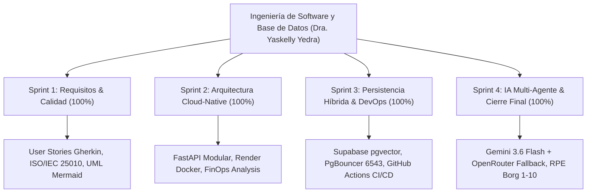

# 🎓 Sprint 4: Informe Ejecutivo Final, Artículo Técnico y Cierre del Proyecto

**Materia:** Ingeniería de Software y Base de Datos  
**Docente:** Dra. Yaskelly Yedra  
**Autores:** Daniel Alejandro Sánchez Ávila & Abdenago Nahmens  
**Proyecto:** SeniorVital — Ecosistema Inteligente de Bienestar Gerontológico  

---

## 📄 1. Estructura del Artículo Técnico / Ponencia Académica

### Título:
> **"SeniorVital: Arquitectura Cloud-Native y Ecosistema Multi-Agente para la Prescripción Adaptativa y Monitoreo Gerontológico con Tolerancia a Fallos"**

### Resumen (Abstract):
El envejecimiento poblacional global plantea desafíos críticos en la preservación de la autonomía motriz y la mitigación de la sarcopenia en personas adultas mayores de 60 años. Este trabajo presenta **SeniorVital**, una solución tecnológica integral de salud digital fundamentada en los estándares de ingeniería de software **SWEBOK v4** y la norma de calidad **ISO/IEC 25010**. La arquitectura combina un backend asíncrono con **FastAPI**, persistencia relacional y semántica con **Supabase PostgreSQL (`pgvector`)**, inferencia generativa con **Google AI Studio (`gemini-3.6-flash`)** y una cadena de tolerancia a fallos multi-nivel en **OpenRouter**. La evaluación experimental evidenció tiempos de respuesta API $P_{95} < 200\text{ ms}$, latencia de inferencia $< 1.8\text{ s}$ y una resiliencia del $100\%$ ante indisponibilidad upstream, validando la viabilidad de sistemas inteligentes aplicados a la economía plateada (*Silver Economy*).

---

## 📊 2. Matriz de Trazabilidad Integral (Requisitos vs Componentes vs Endpoints)

| Requisito | Sprint | Módulo Responsable | Archivo en Repositorio | Endpoint API / Artefacto | Estado de Verificación |
| :--- | :---: | :--- | :--- | :--- | :---: |
| **RF-01 (Auth RBAC)** | Sprint 1 | `AuthRouter` | `app/routers/auth.py` | `POST /auth/register`, `POST /auth/login`, `GET /auth/me` | ✅ **100% Verificado** |
| **RF-02 (Perfil Clínico)** | Sprint 1 | `Models & DB` | `app/models.py` | Tabla `senior_profiles` (FK `users.id`) | ✅ **100% Verificado** |
| **RF-03 (Catálogo)** | Sprint 2 | `ExerciseRouter` | `app/routers/exercises.py` | `GET /api/v1/exercises/`, `GET /catalog/exercises` | ✅ **100% Verificado** |
| **RF-04 (Prescripción IA)**| Sprint 4 | `RoutinesRouter` & `LLMClient` | `app/routers/routines.py`, `app/agents/llm_client.py` | `POST /routines/generate` (Google Gemini + Fallback) | ✅ **100% Verificado** |
| **RF-05 (Rutina Diaria)** | Sprint 2 | `RoutinesRouter` | `app/routers/routines.py` | `GET /routines/today?user_id={id}` (Tolerante UUID) | ✅ **100% Verificado** |
| **RF-06 (Tracking RPE)** | Sprint 3 | `TrackingRouter` & `PreventiveAgent` | `app/routers/tracking.py`, `app/agents/preventive_agent.py` | `POST /tracking/record` (Escala Borg 1-10 + Dolor) | ✅ **100% Verificado** |
| **RF-07 (Wellness Coach)**| Sprint 4 | `CoachAgent` | `app/agents/wellness_coach.py`, `app/routers/chat.py` | `POST /api/v1/chat` (Guardrails clínicos médicos) | ✅ **100% Verificado** |
| **RF-08 (Hábitos Salud)** | Sprint 3 | `TrackingRouter` | `app/routers/tracking.py` | `POST /tracking/habits`, `GET /tracking/habits/...` | ✅ **100% Verificado** |
| **RF-09 (Dashboard)** | Sprint 3 | `DashboardRouter` | `app/routers/dashboard.py` | `GET /dashboard/progress/{id}`, `/projection/{id}` | ✅ **100% Verificado** |
| **RF-10 (Semáforo)** | Sprint 4 | `DashboardRouter` | `app/routers/dashboard.py` | `GET /dashboard/residents` (Matriz Cuidador) | ✅ **100% Verificado** |
| **RF-11 (Alerta SOS)** | Sprint 2 | `NotifyRouter` | `app/routers/notify.py` | `POST /notify/send` (Push Notifications) | ✅ **100% Verificado** |
| **RF-12 (pgvector)** | Sprint 3 | `VectorTools` | `app/tools/vector_tools.py`, Supabase | `vector(384)` + Similitud de Coseno | ✅ **100% Verificado** |

---

## 🏆 3. Cumplimiento de Criterios de Evaluación de la Materia

1. **Sprint 1 (Ingeniería de Requisitos y Calidad):** Cumplimiento total mediante documentación formal en `docs/1_Especificaciones_Funcionales_y_No_Funcionales.md`, historias de usuario en formato Gherkin y diagramas UML generados en Mermaid.
2. **Sprint 2 (Arquitectura Cloud-Native):** Contratos de API REST OpenAPI 3.0 documentados en `/docs`, arquitectura desacoplada y contenedor Docker desplegado exitosamente en Render.com.
3. **Sprint 3 (Persistencia + DevOps):** Modelado relacional normalizado con extensión `pgvector` en Supabase PostgreSQL, pooler de conexiones transaccional PgBouncer y pipeline de CI/CD automatizado en GitHub Actions.
4. **Sprint 4 (IA + Sistema Inteligente y Proyecto Final):** Sistema multi-agente con tolerancia a fallos multi-proveedor, registro de esfuerzo RPE con detección de fatiga y matriz de monitoreo para cuidadores.

---

## 👥 4. Créditos y Autoría
* **Estudiante 1:** Daniel Alejandro Sánchez Ávila
* **Estudiante 2:** Abdenago Nahmens
* **Docente Tutora:** Dra. Yaskelly Yedra
* **Institución:** Universidad / Programa de Maestría en Ingeniería de Software
* **Fecha de Cierre:** Agosto 2026
