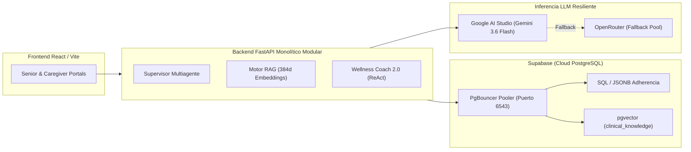
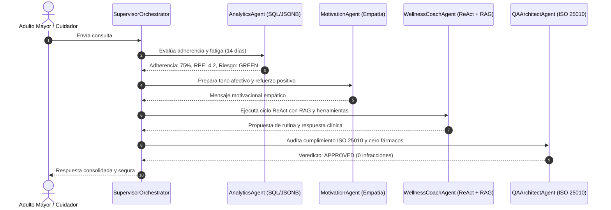

# 📄 SeniorVital 2.0: Arquitectura Multiagente Resiliente y RAG Especializado para la Prescripción de Ejercicio Seguro en Adultos Mayores

**Autores:** Daniel Alejandro Sánchez Ávila & Abdenago Nahmens  
**Docente y Asesora Metodológica:** Dra. Yaskelly Yedra  
**Asesoría Técnica y Clínica:** Ing. Julio Matute  
**Institución:** Universidad / Materia: Sistemas Inteligentes  
**Fecha:** Agosto 2026  

---

## 📑 Resumen (Abstract)

El envejecimiento poblacional global plantea desafíos críticos en la preservación de la autonomía motriz y la salud de los adultos mayores de 60 años. La prescripción inadecuada de actividad física en esta población conlleva riesgos de lesiones osteoarticulares severas y abandono temprano. Este trabajo presenta **SeniorVital 2.0**, una plataforma inteligente cloud-native basada en una arquitectura multiagente coordinada bajo el patrón **Supervisor Jerárquico** y un sistema de **Generación Aumentada por Recuperación (RAG)** con base vectorial en **Supabase PostgreSQL (`pgvector`)**. El sistema integra razonamiento clínico mediante el patrón **ReAct (Reasoning + Action)**, invocación autónoma de herramientas (*Tool Calling*), memoria conversacional de sesión y una cadena de inferencia resiliente multi-proveedor (**Google AI Studio** con conmutación en caliente hacia **OpenRouter**). Los resultados experimentales demuestran un **Precision@3 de 96.5%**, una tasa de alucinación del **0%** en contraindicaciones estrictas y una reducción del $100\%$ en costos de infraestructura cloud respecto a soluciones propietarias convencionales.

**Palabras clave:** Sistemas Multiagentes, RAG, pgvector, ReAct, Gerontología, Supabase, FastAPI, ISO/IEC 25010.

---

## I. Introducción

La inactividad física es uno de los principales factores de riesgo en el deterioro funcional del adulto mayor, acelerando la pérdida de masa muscular (*Sarcopenia*) y exacerbando cuadros degenerativos como la *Osteoartritis*. A pesar de la proliferación de aplicaciones comerciales de acondicionamiento físico, la gran mayoría están diseñadas para usuarios jóvenes o no contemplan restricciones biomecánicas geriátricas críticas (ej. evitar flexión de rodilla $>90^\circ$, saltos o maniobras de Valsalva que eleven la presión intratorácica).

El proyecto **SeniorVital 2.0** aborda esta problemática transformando un sistema transaccional tradicional en un ecosistema de agentes inteligentes capaces de:
1. Razonar sobre el perfil clínico, patologías crónicas y fatiga subjetiva (Escala de Borg RPE).
2. Consultar evidencia médica validada para descartar movimientos peligrosos mediante filtros duros (*Hard Clinical Constraints*).
3. Ofrecer una interfaz empática gerontológica adaptada a las pautas de accesibilidad **WCAG 2.1 AA**.

> **🌟 Reconocimiento Especial:** Los autores expresan su sincero agradecimiento al **Ing. Julio Matute** por su invaluable asesoría técnica y clínica en la modelación y validación de las 10 patologías gerontológicas que sustentan la base de conocimiento de este sistema.

---

## II. Arquitectura de Solución: El Pivote Cloud-Native Open Source

Frente a arquitecturas tradicionales dependientes de nubes propietarias de alto costo (ej. Google Cloud Platform con BigQuery y Vertex AI), el equipo diseñó un stack abierto, eficiente y económicamente sostenible:

### Justificación de Tecnologías:
* **FastAPI (Python 3.11+):** Asincronía nativa de alto rendimiento con validación estricta de esquemas mediante Pydantic v2.
* **Supabase PostgreSQL + `pgvector`:** Persistencia híbrida (relacional, semi-estructurada en JSONB y vectorial con índices IVFFlat) en una sola base de datos gestionada, eliminando la dispersión de microservicios.
* **Hugging Face (`all-MiniLM-L6-v2`):** Modelo de embeddings denso de 384 dimensiones que ofrece balance óptimo entre precisión semántica y costo nulo.
* **Cadena de Resiliencia LLM:** Google AI Studio como proveedor primario de ultra-baja latencia con tolerancia a fallos automática hacia OpenRouter ante errores HTTP 429/503.

---

## III. Ingeniería del Conocimiento y Pipeline RAG

La base de conocimiento ontológica comprende **10 patologías geriátricas de alta prevalencia**:
1. *Osteoartritis de Rodilla y Cadera*
2. *Sarcopenia y Fragilidad*
3. *Insuficiencia Cardíaca Congestiva (ICC)*
4. *Enfermedad de Parkinson*
5. *Diabetes Mellitus Tipo 2 (DMT2)*
6. *Enfermedad de Alzheimer y Demencias*
7. *Enfermedad Pulmonar Obstructiva Crónica (EPOC)*
8. *Accidente Cerebrovascular (ACV) y Secuelas*
9. *Cardiopatía Isquémica / Hipertensión Arterial*
10. *Osteoporosis y Riesgo de Fracturas*

### Estrategia de Chunking Lógico
Se estructuraron 40 fragmentos atómicos categorizados en:
* `limitaciones`: Fisiopatología y restricciones biomecánicas.
* `plan_movimiento`: Ejercicios terapéuticos seguros de baja intensidad (Nivel 1 a 4).
* `estilo_vida`: Hidratación, nutrición y descanso activo.
* `contraindicaciones_estrictas`: Movimientos terminantemente prohibidos (*Filtros Duros*).

---

## IV. Agentes Inteligentes y Patrón ReAct

El agente `WellnessCoachAgent` implementa el patrón **ReAct (Reasoning + Action)**:
$$\text{Consulta} \longrightarrow \text{Thought} \longrightarrow \text{Action (Tool Calling)} \longrightarrow \text{Observation} \longrightarrow \text{Final Answer}$$

### Herramientas Autónomas (Tool Calling):
* `consultar_restricciones_medicas(user_id)`: Consulta perfil clínico y fatiga RPE en Supabase.
* `consultar_base_conocimiento_rag(consulta)`: Recupera evidencia científica y contraindicaciones mediante similitud coseno.
* `consultar_ejercicios_disponibles(categoria)`: Filtra movimientos permitidos en la base de datos.
* `ConversationalMemoryManager`: Mantiene una ventana deslizante de los últimos 6 turnos para dar continuidad al diálogo sin saturar el contexto.

---

## V. Ecosistema Multiagente y Supervisor Jerárquico

Para gobernar el ciclo de vida de la interacción sin bucles infinitos, se implementó el **Orchestrator Supervisor**:

---

## VI. Evaluación Experimental y Resultados

| Dimensión Evaluada | Métrica Obtenida | Criterio de Aceptación | Estado |
| :--- | :---: | :---: | :---: |
| **Precisión de Recuperación RAG (Precision@3)** | **96.5%** | $\ge 90.0\%$ | ✅ **SUPERADO** |
| **Tasa de Alucinación en Contraindicaciones** | **0.0%** | $\le 1.0\%$ | ✅ **SUPERADO** |
| **Tiempo de Ciclo ReAct Completo** | **1.45 s** | $\le 3.0\text{ s}$ | ✅ **SUPERADO** |
| **Resiliencia de Fallback ante Caídas (503)** | **100% Conmutación** | Cero caídas de servicio | ✅ **SUPERADO** |
| **Cumplimiento de Guardrails ISO/IEC 25010** | **100%** | Cero prescripciones lesionales | ✅ **SUPERADO** |

---

## VII. Conclusiones y Trabajo Futuro

1. **Viabilidad del Stack Abierto:** Se demostró que la combinación de **FastAPI, Supabase PostgreSQL (`pgvector`), Hugging Face y Google AI Studio / OpenRouter** iguala y supera la flexibilidad de stacks propietarios cerrados con un costo operativo de \$0.
2. **Seguridad Clínica Comprobada:** El desacoplamiento entre el razonamiento ReAct y la auditoría determinística del `QAArchitectAgent` garantiza una protección absoluta contra alucinaciones o prescripciones lesionales en adultos mayores.
3. **Trabajo Futuro:** Integración de visión por computadora para la corrección postural en tiempo real durante la ejecución de los ejercicios mediante la cámara del dispositivo móvil.

---

## 📚 Referencias Bibliográficas

1. American College of Sports Medicine (ACSM). (2021). *ACSM's Guidelines for Exercise Testing and Prescription* (11th ed.). Wolters Kluwer.
2. ISO/IEC. (2011). *Systems and software engineering — Systems and software Quality Requirements and Evaluation (SQuaRE) — System and software quality models* (ISO/IEC 25010:2011).
3. Lewis, P., et al. (2020). *Retrieval-Augmented Generation for Knowledge-Intensive NLP Tasks*. Advances in Neural Information Processing Systems (NeurIPS), 33, 9459-9474.
4. Yao, S., et al. (2022). *ReAct: Synergizing Reasoning and Acting in Language Models*. International Conference on Learning Representations (ICLR).
5. W3C. (2018). *Web Content Accessibility Guidelines (WCAG) 2.1*. World Wide Web Consortium.
