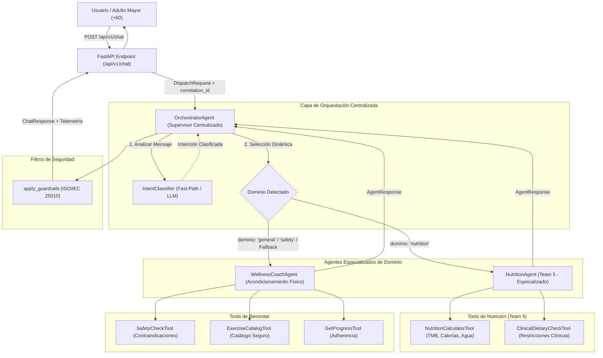

# Arquitectura del Ecosistema Multiagente — SeniorVital

**Proyecto:** SeniorVital — Plataforma de Bienestar para Adultos Mayores  
**Materia:** Sistemas Inteligentes  
**Docente:** Dra. Yaskelly Yedra  
**Equipo:** Team 5  
**Autores:** Daniel Alejandro Sánchez Ávila & Abdenago Nahmens  
**Sprint:** Sprint 3 — Sistemas Multiagentes y Orquestación  

---

## 1. Evaluación y Comparación Formal de Patrones Arquitectónicos

En el diseño del ecosistema multiagente de SeniorVital, evaluamos formalmente cuatro patrones arquitectónicos reconocidos en la literatura de Sistemas Multiagentes (MAS) y orquestación con Modelos de Lenguaje (LLMs):

| Patrón | Mecanismo de Coordinación | Sobrecarga de Tokens | Latencia Estimada | Determinismo y Trazabilidad | Adecuación para Adultos Mayores |
| :--- | :--- | :--- | :--- | :--- | :--- |
| **Sequential (Secuencial)** | Cadena lineal fija (Agente A → Agente B → Agente C). | Media (acumulativa en cada eslabón). | Alta (suma aritmética de todos los turnos). | Alta pero rígida (no permite bifurcaciones dinámicas). | **Deficiente:** Sobrecarga innecesaria si la consulta solo requería un consejo puntual de dieta o hidratación. |
| **Hierarchical (Jerárquico)** | Árbol de supervisores y sub-orquestadores por subdominio. | Muy Alta (múltiples llamadas a LLMs para coordinar subárboles). | Muy Alta (> 3.5s debido a hops múltiples). | Media (árboles complejos dificultan auditoría clínica en tiempo real). | **Inadecuada:** Genera tiempos de respuesta prohibitivos para adultos mayores con umbral bajo de atención. |
| **Swarm (Enjambre / P2P)** | Comunicación descentralizada emergente entre pares. | Impredecible (riesgo de bucles y explosión combinatoria). | Variable (dependiente de la convergencia emergente). | Nula o muy baja (propensa a alucinaciones cruzadas y divergencia). | **Inadmisible:** En gerontología y salud, la falta de determinismo compromete la seguridad clínica del paciente. |
| **Supervisor Centralizado** *(Seleccionado)* | Un único orquestador central clasifica la intención, delega al agente especializado idóneo y sintetiza/valida la respuesta. | **Baja y Óptima** (1 clasificación rápida + 1 ejecución especializada). | **Mínima** (< 1s en canal conversacional). | **Determinista y Estricta** (contratos `AgentMessage` con `correlation_id`). | **Excelente:** Respuestas contextualizadas, inmediatas y estrictamente filtradas por guardrails. |

---

## 2. Declaración y Justificación del Patrón Supervisor Centralizado

Adoptamos formalmente el **Patrón Supervisor Centralizado** (*Centralized Supervisor Pattern*) como el estándar arquitectónico de SeniorVital. Erradicamos de forma definitiva la denominación ambigua "Supervisor Jerárquico", clarificando que el sistema **no** implementa sub-árboles de mando en cascada, sino un enrutamiento centralizado de baja latencia.

### Razones Técnicas de la Selección:
1. **Minimización de Sobrecarga de Tokens:** En un modelo jerárquico multinivel, cada sub-orquestador consume tokens de contexto para re-clasificar y delegar. El supervisor centralizado resuelve la intención en un solo ciclo (mediante fast-path por heurística léxica o un prompt de clasificación acotado en formato JSON), preservando la ventana de contexto para el razonamiento clínico del agente de dominio.
2. **Latencia Óptima para Consultas Geriátricas:** Los adultos mayores de 60 años demandan retroalimentación conversacional rápida. Tiempos de espera superiores a 2-3 segundos deterioran la experiencia y generan desorientación. El supervisor centralizado despacha la consulta al agente idóneo en milisegundos.
3. **Trazabilidad y Auditoría Determinista:** Mediante el esquema estandarizado `AgentMessage` y la propagación de un `correlation_id` único, cada evento (clasificación, selección, ejecución de herramientas y chequeo de seguridad) queda auditado en un log estructurado, facilitando el cumplimiento de la norma **ISO/IEC 25010** y auditorías clínicas.
4. **Resiliencia y Degradación Elegante:** Si un agente de dominio no se encuentra disponible o falla, el supervisor captura la excepción y activa inmediatamente el agente de fallback (`WellnessCoachAgent`) sin propagar errores al usuario final.

---

## 3. Diagrama Arquitectónico del Patrón Supervisor Centralizado

---

## 4. Agente Especializado Asignado: NutritionAgent (Team 5)

El **NutritionAgent** es el agente especializado asignado y desarrollado integralmente por el **Team 5**. Su propósito es ofrecer asesoramiento dietético, hídrico y nutricional científicamente fundamentado para adultos mayores, considerando condiciones crónicas comunes en geriatría.

### Capacidades del NutritionAgent:
1. **Herramientas Nutricionales Especializadas (`src/agents/nutrition/tools.py`):**
   - **`NutritionCalculatorTool`:** Cálculo determinístico de Tasa Metabólica Basal (fórmula Mifflin-St Jeor ajustada a adultos mayores), requerimiento calórico diario, balance de macronutrientes (proteínas de 1.0 a 1.2 g/kg para prevención de sarcopenia) y cálculo cuantitativo de hidratación hídrica (30-35 ml/kg/día).
   - **`ClinicalDietaryCheckTool`:** Motor de reglas que verifica la compatibilidad de alimentos con diagnósticos preexistentes:
     - **Hipertensión arterial:** Detección de sodio/sal, embutidos y alimentos procesados; sugerencia de opciones DASH.
     - **Diabetes Mellitus Tipo 2:** Detección de carbohidratos simples, azúcares añadidos; priorización de fibra soluble y control glucémico.
     - **Osteoartritis / Dolor articular:** Sugerencia de alimentos antiinflamatorios (omega-3, antioxidantes) y control calórico para reducción de carga articular.
     - **Enfermedad Renal Crónica:** Restricciones de potasio, fósforo y carga proteica excesiva.

2. **Prompts Gerontológicos Adaptados:**
   - Tono empático, claro y respetuoso (WCAG 2.1 AA).
   - Redacción sin tecnicismos confusos, destacando consejos prácticos sobre preparaciones caseras, texturas fáciles de masticar y recordatorios constantes de hidratación.
   - Recordatorio mandatorio de no sustitución de prescripciones médicas oficiales.

3. **Integración con el Ciclo ReAct:**
   - Capacidad de razonamiento iterativo: evalúa la consulta clínica, invoca las herramientas de cálculo o verificación, analiza las observaciones y formula la respuesta final estructurada.
