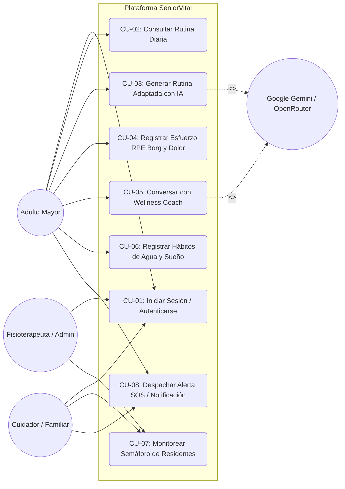
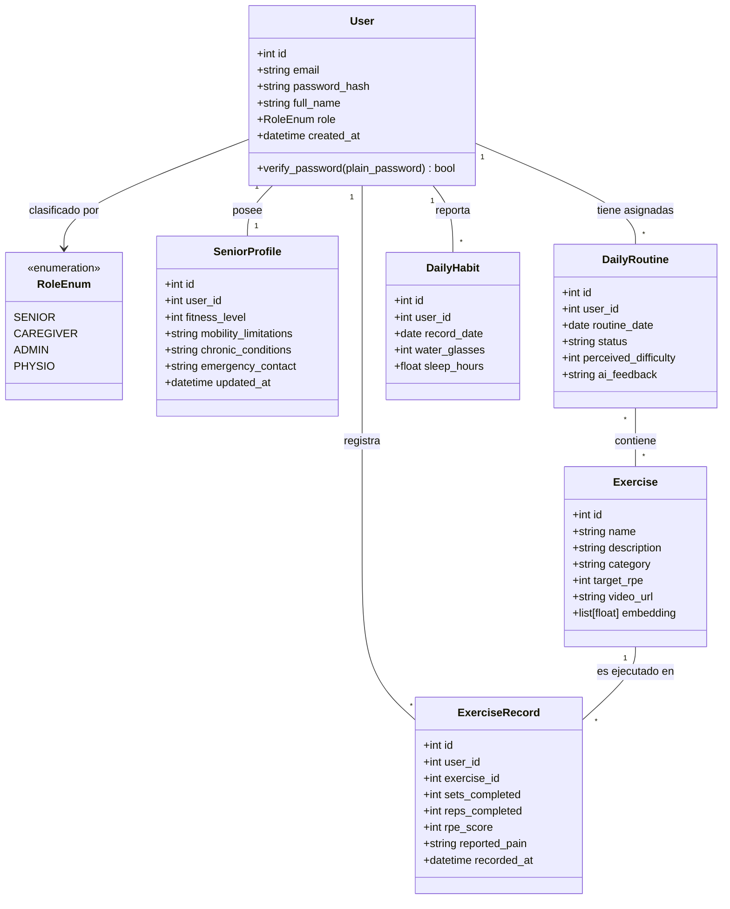
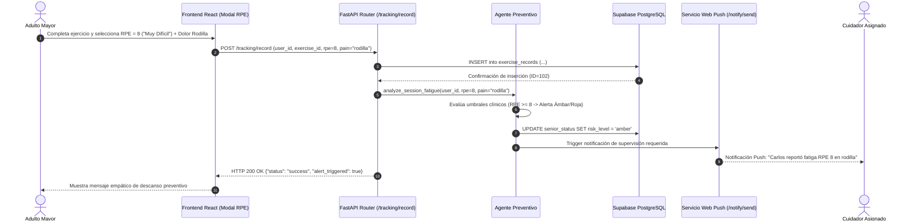
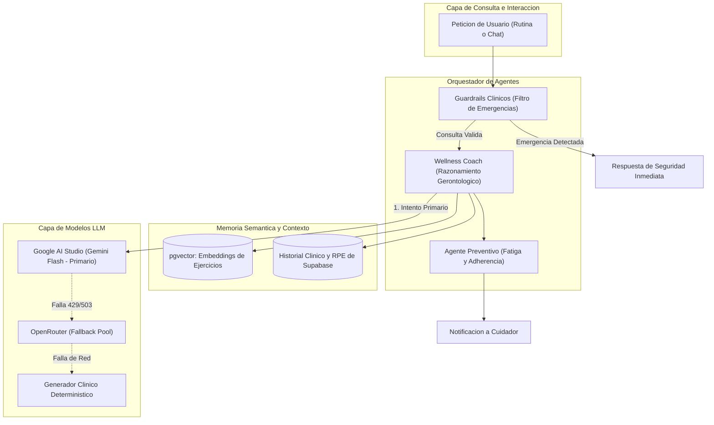
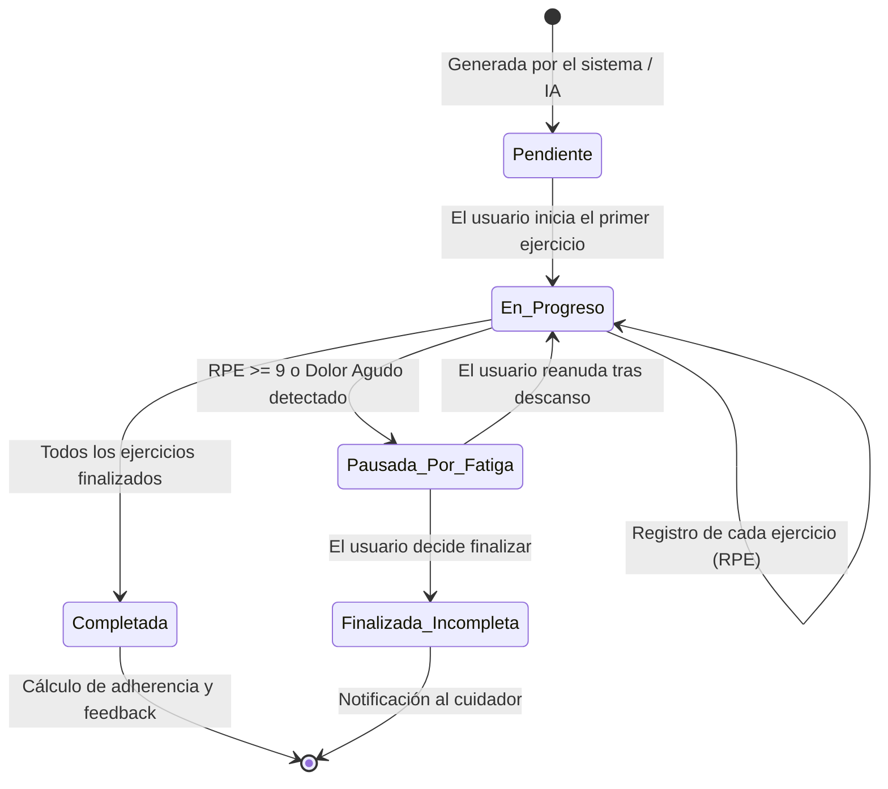

# 📐 Sprint 1, 2 & 4: Modelado Visual y Diagramas UML Completos

**Materia:** Ingeniería de Software y Base de Datos  
**Docente:** Dra. Yaskelly Yedra  
**Autores:** Daniel Alejandro Sánchez Ávila & Abdenago Nahmens  
**Proyecto:** SeniorVital — Arquitectura y Modelado Orientado a Objetos  

---

## 👥 1. Diagrama de Casos de Uso del Sistema (UML Use Case Diagram)

---

## 🏛️ 2. Diagrama de Clases del Dominio (UML Class Diagram)

---

## 🔄 3. Diagrama de Secuencia: Registro de Esfuerzo RPE y Alerta Preventiva

---

## 🤖 4. Diagrama de Arquitectura del Ecosistema Multi-Agente

---

## ⏳ 5. Diagrama de Estados de una Rutina Diaria (State Machine Diagram)

