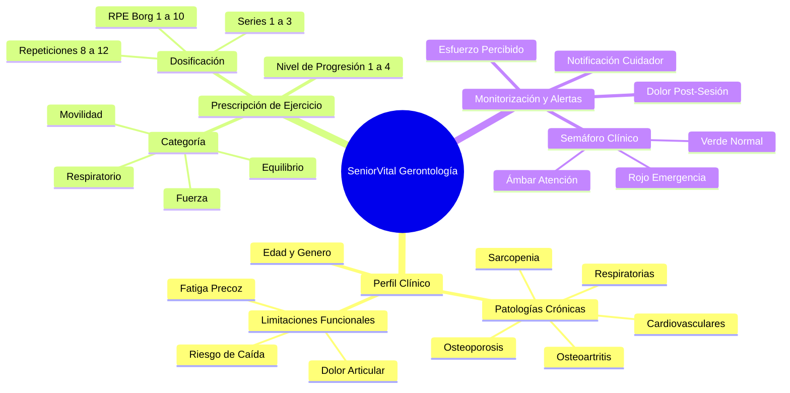

# 🗺️ Mapa de Dominio Clínico Gerontológico

> **Materia:** Sistemas Inteligentes — Dra. Yaskelly Yedra  
> **Autores:** Daniel Sánchez & Abdenago Nahmens | **Asesoría Clínica:** Ing. Julio Matute  

---

## 1. Mapeo de Entidades del Dominio

