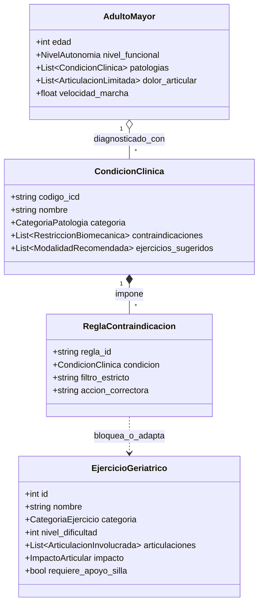

# 🧬 Ontología Médica y Modelo Conceptual de Conocimiento Geriátrico

> **Materia:** Sistemas Inteligentes  
> **Docente:** Dra. Yaskelly Yedra  
> **Autores:** Daniel Alejandro Sánchez Ávila & Abdenago Nahmens  
> **Asesoría Clínica:** Ing. Julio Matute  

---

## 1. Clases Principales de la Ontología

## 2. Axiomas y Restricciones de Inferencia
1. **Regla de Carga Axial en Osteoartritis:**  
   `Si AdultoMayor presenta Osteoartritis_Rodilla -> Bloquear Ejercicio con ImpactoArticular == ALTO o FlexionRodilla > 90 grados.`
2. **Regla de Flexión Espinal en Osteoporosis:**  
   `Si AdultoMayor presenta Osteoporosis -> Bloquear FlexionTroncoConCarga (Abdominales crunch) y RotacionEspinalBrusca.`
3. **Regla de Esfuerzo en Cardiopatías:**  
   `Si AdultoMayor presenta ICC o CardiopatiaIsquemica -> Limitar Intensidad a Borg RPE <= 5 ("Moderado").`
4. **Regla de Progresión Segura:**  
   `Nivel de dificultad de rutina generado <= max(NivelSeguro) de las patologías diagnosticadas.`
