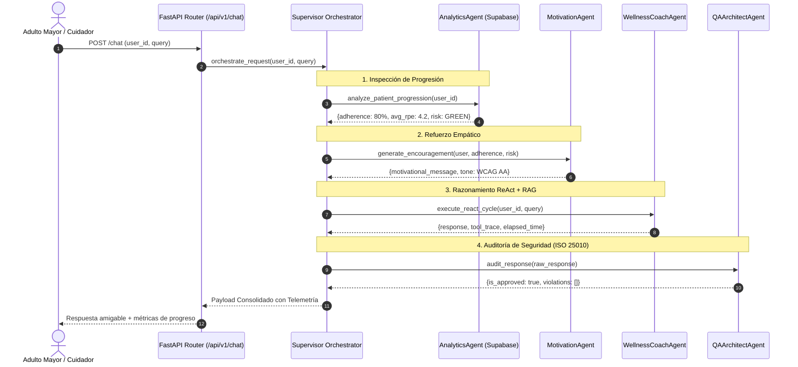

# Protocolo de Comunicación Inter-Agente y Paso de Mensajes (A2A)

## 1. Estructura de Mensajería Inter-Agente

La comunicación entre agentes especializados se fundamenta en un contrato estricto de paso de mensajes sin acoplamiento a librerías propietarias:

```python
class AgentMessage:
    id: str               # Identificador único de mensaje
    correlation_id: str   # Trazabilidad transaccional compartida
    parent_id: str        # Identificador del mensaje emisor
    source: str           # Nombre del agente emisor
    target: str           # Nombre del agente receptor
    message_type: str     # request | response | alert | audit
    payload: dict         # Datos estructurados del dominio
    timestamp: str        # Marca de tiempo ISO-8601 UTC
```

## 2. Flujo de Ejecución y Paso de Parámetros



## 3. Tolerancia a Fallos y Degrado Agraciado

- **Caída de Conexión a Supabase:** Si el pool asíncrono hacia PostgreSQL no responde en el tiempo límite, `AnalyticsAgent` retorna métricas históricas conservadoras por omisión, sin abortar el flujo motivacional ni conversacional.
- **Fallo del Modelo de Inferencia:** Si Google AI Studio retorna un código 429 o 503, el pipeline conmuta hacia el pool de OpenRouter, o en última instancia al motor clínico determinista de RAG, preservando la continuidad del servicio.
- **Violación Detectada por QA:** Si la respuesta generada menciona fármacos o prescripciones de impacto, `QAArchitectAgent` bloquea el texto crudo y el orquestador sustituye la respuesta por una recomendación preventiva sanitizada.
