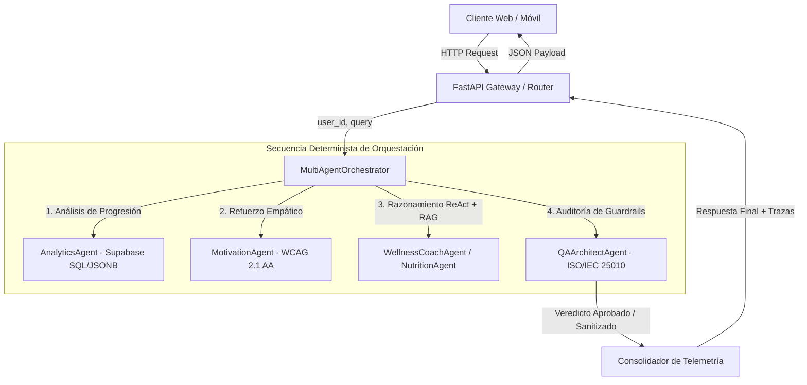

# Patrón de Orquestación Supervisor — Ecosistema Multiagente SeniorVital

## 1. Visión Arquitectónica y Justificación

Para el Sprint 3 de SeniorVital adoptamos el patrón **Supervisor Jerárquico** (*Hierarchical Supervisor Pattern*). La interacción clínica y de bienestar con adultos mayores requiere alta confiabilidad, trazabilidad determinista y tiempos de respuesta acotados, condiciones que los esquemas de enjambre libre (*peer-to-peer swarm*) no garantizan al ser propensos a divergencias o ciclos infinitos.

El **Orchestrator Agent** actúa como nodo raíz del flujo:
1. Recepciona la consulta del usuario o cuidador desde la API de FastAPI.
2. Clasifica la intención clínica mediante reglas de dominio asistidas por LLM.
3. Invoca en secuencia desacoplada al agente analítico (`AnalyticsAgent`), motivacional (`MotivationAgent`) y al agente conversacional especializado (`WellnessCoachAgent` o `NutritionAgent`).
4. Somete la respuesta preliminar al agente auditor de calidad (`QAArchitectAgent`) para garantizar cumplimiento de la norma ISO/IEC 25010 antes de devolver el payload consolidado.

## 2. Prevención de Ciclos Infinitos y Terminación Garantizada

Para garantizar que el flujo siempre concluya dentro de las restricciones de latencia:
- **Estructura Aclíclica Estricta:** Las transiciones entre agentes están orientadas exclusivamente hacia adelante (DAG). Ningún agente secundario puede reenviar peticiones de vuelta al supervisor para reevaluación ciega.
- **Límites de Reintento y Profundidad:** El ciclo ReAct interno del coach tiene un umbral máximo de 3 iteraciones de tool calling. Si se alcanza el límite sin converger, se emite una respuesta clínica de contingencia.
- **Manejo de Desconexiones:** Si la base de datos o el proveedor de inferencia falla, los agentes capturan la excepción y generan un resultado degradado seguro con bandera `status: FALLBACK`, permitiendo que el supervisor complete la respuesta sin congelar el hilo de ejecución.

## 3. Telemetría y Observabilidad Unificada

Cada ejecución genera un identificador único de trazabilidad (`trace_id` / `correlation_id`) y consolida:
- Tiempos de ejecución discriminados por agente (`elapsed_ms`).
- Métricas analíticas recuperadas de Supabase (`adherence_rate`, `avg_rpe`, `risk_level`).
- Estado de validación clínica de guardrails (`APPROVED` o `SANITIZED`).
- Modo efectivo de recuperación vectorial y generación LLM reportados desde el pipeline RAG de S1.
