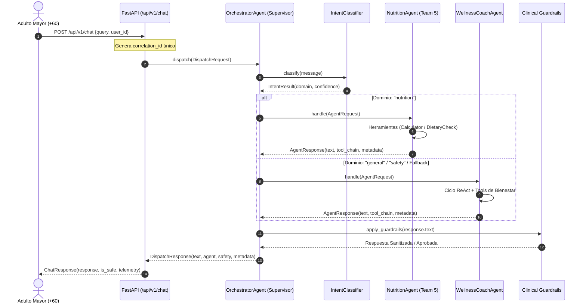

# Patrón de Orquestación: Supervisor Centralizado — SeniorVital

**Proyecto:** SeniorVital — Ecosistema Multiagente y Orquestación  
**Materia:** Sistemas Inteligentes  
**Docente:** Dra. Yaskelly Yedra  
**Equipo:** Team 5  
**Autores:** Daniel Alejandro Sánchez Ávila & Abdenago Nahmens  
**Sprint:** Sprint 3  

---

## 1. Visión y Justificación del Patrón Supervisor Centralizado

En el Sprint 3 implementamos y consolidamos el **Patrón Supervisor Centralizado** (*Centralized Supervisor Pattern*). La interacción clínica orientada al bienestar de adultos mayores exige:
- **Tiempos de respuesta inmediatos (< 1 segundo)** en canales conversacionales interactivos.
- **Trazabilidad determinista de extremo a extremo** mediante identificadores de correlación (`correlation_id`).
- **Control estricto de guardrails de seguridad** antes de que cualquier contenido sea devuelto al paciente o cuidador.

Erradicamos formalmente el término ambiguo *"Supervisor Jerárquico"*. El sistema opera bajo un único nodo orquestador central (`OrchestratorAgent`) en `src/orchestration/` que:
1. Recibe la solicitud del usuario a través del endpoint `/api/v1/chat` en un contenedor `DispatchRequest`.
2. Clasifica la intención del usuario mediante `IntentClassifier` (combinando un *fast-path* determinístico por palabras clave clínicas y un clasificador semántico basado en LLM).
3. Selecciona dinámicamente y delega la tarea al agente especializado correspondiente:
   - **`NutritionAgent` (Team 5):** Consultas sobre dietas, hidratación, grupos de alimentos y restricciones por diabetes o hipertensión.
   - **`WellnessCoachAgent`:** Consultas sobre rutinas de ejercicios de bajo impacto, dolor articular, progreso físico y soporte conversacional general.
4. Aplica una capa de auditoría determinística (`apply_guardrails`) que bloquea prescripciones farmacológicas o ejercicios biomecánicamente lesivos (ISO/IEC 25010).

---

## 2. Diagrama de Secuencia del Supervisor Centralizado

---

## 3. Protocolo Unificado de Delegación y Contratos de Mensajería

La comunicación entre el Supervisor y los agentes especializados está desacoplada mediante estructuras inmutables tipadas:

### 3.1. `DispatchRequest` y `DispatchResponse` (`src/orchestration/dispatch.py`)
- **`DispatchRequest`:** Empaqueta `request_id`, `user_id`, `message`, `intent`, `payload`, `context` y `correlation_id`.
- **`DispatchResponse`:** Devuelve `text`, `agent`, `intent`, `safety_level`, `tool_chain`, `blocked`, `duration_ms` y `metadata`.

### 3.2. `AgentMessage` (`src/orchestration/agent_protocol.py`)
Constituye el contrato de red interno. Asegura que ningún agente retenga referencias circulares con el orquestador:
- Campos: `from_agent`, `to_agent`, `content`, `message_type`, `correlation_id`, `parent_id`.

### 3.3. Prevención de Ciclos y Recursión
- **Seguimiento de correlaciones activas (`_active_correlations`):** Si una solicitud reentrante porta un `correlation_id` ya en procesamiento, el supervisor eleva un `OrchestrationError` impidiendo bucles infinitos.
- **Límites de iteración ReAct:** Los agentes de dominio tienen configurado un máximo estricto de 3 iteraciones de razonamiento.

---

## 4. Observabilidad y Métricas en Tiempo Real

El sistema utiliza `OrchestrationLogger` para emitir eventos estructurados en formato JSON por cada fase del ciclo de vida:
- `route_start` / `dispatch_start`
- `intent_classified`
- `agent_selected`
- `route_end` / `dispatch_end`
- `safety_check`

Estos eventos permiten correlacionar latencias, evaluar precisión de enrutamiento y auditar la trazabilidad clínica completa de cada consulta.
