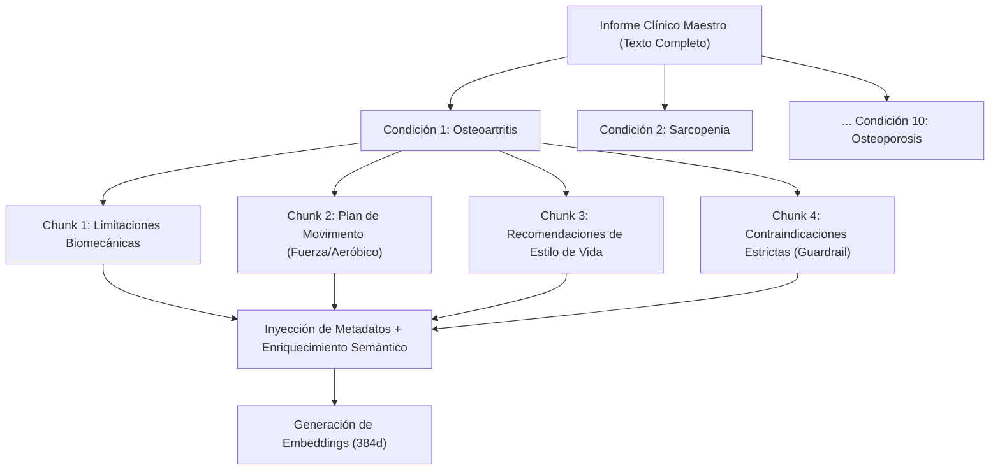

# 🧩 Issue S1-02: Estrategia de Segmentación Semántica (Logical Chunking)

**Materia:** Sistemas Inteligentes  
**Docente:** Dra. Yaskelly Yedra  
**Autores:** Daniel Alejandro Sánchez Ávila & Abdenago Nahmens  
**Proyecto:** SeniorVital 2.0 — Sistema RAG Gerontológico  
**Sprint Técnico:** Sprint 1 — Ingeniería del Conocimiento y Sistemas RAG  

---

## 🎯 1. Justificación y Diseño de la Estrategia de Chunking

En aplicaciones clínicas de alta precisión, la segmentación tradicional por longitud de caracteres fija (*Fixed-size Window Chunking*) presenta severas desventajas:
* Puede cortar oraciones en medio de una **contraindicación crítica** (*ej. "Prohibido..." separado del tipo de ejercicio*).
* Diluye la relación ontológica entre la **patología** y el **plan de movimiento adaptado**.

Por ello, se implementó una estrategia de **Chunking Lógico Estructurado (Semantic / Logical Chunking)** donde cada unidad de conocimiento es atómica, autosuficiente y preserva el contexto completo.



---

## 📐 2. Estructura de los Chunks Generados

Cada fragmento almacenado en la base de datos vectorial sigue el siguiente esquema JSON:

```json
{
  "condicion": "Osteoartritis de Rodilla y Cadera",
  "categoria": "contraindicaciones_estrictas",
  "contenido_texto": "Queda estrictamente prohibida la prescripción de ejercicios que incluyan pliometría (saltos), impactos balísticos continuos sobre superficies duras, posturas de torsión extrema bajo carga y flexión profunda de rodilla (mayor a 90 grados) sin soporte estructural, por riesgo de fisura meniscal.",
  "metadata": {
    "fuente": "OARSI guidelines for the non-surgical management of knee, hip, and polyarticular osteoarthritis",
    "autor": "Bannuru et al., 2019",
    "tipo_riesgo": "articular_severo",
    "asesoria_tecnica_clinica": "Reconocimiento especial al Ing. Julio Matute por su asesoría técnica y clínica en la validación de patologías, afecciones y enfermedades limitantes en adultos mayores, las cuales fundamentan esta base de conocimiento."
  },
  "text_for_embedding": "Condición: Osteoartritis de Rodilla y Cadera. Categoría: contraindicaciones_estrictas. Contenido: Queda estrictamente prohibida la prescripción de ejercicios que incluyan pliometría..."
}
```

---

## 📊 3. Métricas de la Segmentación

* **Total de Condiciones Clínicas Procesadas:** 10 patologías geriátricas mayores.
* **Categorías Semánticas por Condición:** 4 (`limitaciones`, `plan_movimiento`, `estilo_vida`, `contraindicaciones_estrictas`).
* **Total de Chunks Lógicos:** **40 chunks atómicos**.
* **Longitud Promedio por Chunk:** ~65 a 120 palabras (~110 a 220 tokens), garantizando densidad semántica y óptima relación señal/ruido para el modelo de embeddings.
