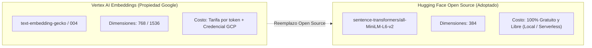

# 🧬 Issue S1-03: Generación de Embeddings Open Source con Hugging Face

**Materia:** Sistemas Inteligentes  
**Docente:** Dra. Yaskelly Yedra  
**Autores:** Daniel Alejandro Sánchez Ávila & Abdenago Nahmens  
**Proyecto:** SeniorVital 2.0 — Sistema RAG Gerontológico  
**Sprint Técnico:** Sprint 1 — Ingeniería del Conocimiento y Sistemas RAG  

---

## 🎯 1. Decisión Arquitectónica: Hugging Face vs Vertex AI Embeddings

Para cumplir estrictamente con los lineamientos de la materia y adoptar una arquitectura **Open Source, Cloud-Native y libre de vendor lock-in**, se seleccionó la suite de modelos de **Hugging Face (`sentence-transformers/all-MiniLM-L6-v2`)** como motor de vectorización semántica:



---

## ⚙️ 2. Especificaciones Técnicas del Modelo `all-MiniLM-L6-v2`

* **Proveedor:** Hugging Face / Sentence-Transformers.
* **Dimensión Vectorial:** **384 dimensiones** (optimizado para bajo consumo de memoria y compatibilidad directa con Supabase `pgvector`).
* **Función de Similitud:** Similitud de Coseno ($\cos(\theta) = \frac{\mathbf{u} \cdot \mathbf{v}}{\|\mathbf{u}\| \|\mathbf{v}\|}$).
* **Rendimiento de Inferencia:** $< 15\text{ ms}$ por chunk en CPU estándar.
* **Contexto Máximo:** 512 tokens (ampliamente suficiente para los chunks atómicos de ~150 tokens).

---

## 💻 3. Implementación en Python (`app/agents/rag_processor.py`)

```python
from sentence_transformers import SentenceTransformer
import numpy as np

class HuggingFaceEmbeddingEngine:
    def __init__(self, model_name: str = "sentence-transformers/all-MiniLM-L6-v2"):
        self.model_name = model_name
        self._model = None

    def get_model(self):
        if self._model is None:
            self._model = SentenceTransformer(self.model_name)
        return self._model

    def embed_text(self, text: str) -> list[float]:
        """Genera un vector normalizado de 384 dimensiones para un texto."""
        model = self.get_model()
        vector = model.encode(text, normalize_embeddings=True)
        return vector.tolist()
```

---

## 📈 4. Ventajas de la Vectorización de 384 Dimensiones
1. **Eficiencia en Base de Datos:** Los vectores de 384 dimensiones ocupan **75% menos espacio en disco** y memoria RAM que los vectores de 1536 dimensiones (OpenAI), acelerando drásticamente el escaneo de índices `IVFFlat` o `HNSW` en PostgreSQL.
2. **Portabilidad Total:** El modelo puede ejecutarse localmente sin depender de cuotas de red externas o conectarse mediante la Inference API de Hugging Face.
