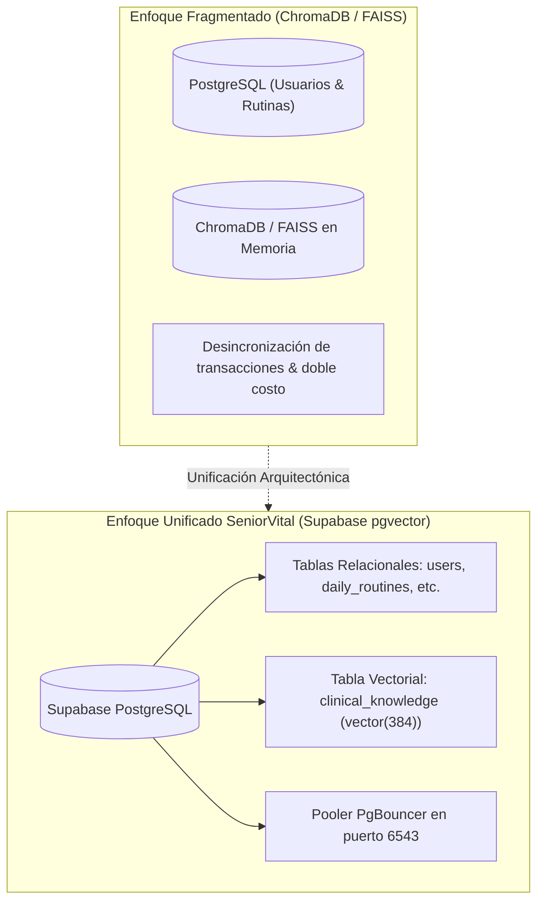

# 🗄️ Issue S1-04: Almacenamiento e Indexación Vectorial con Supabase pgvector

**Materia:** Sistemas Inteligentes  
**Docente:** Dra. Yaskelly Yedra  
**Autores:** Daniel Alejandro Sánchez Ávila & Abdenago Nahmens  
**Proyecto:** SeniorVital 2.0 — Sistema RAG Gerontológico  
**Sprint Técnico:** Sprint 1 — Ingeniería del Conocimiento y Sistemas RAG  

---

## 🎯 1. Decisión de Persistencia Unificada: Supabase `pgvector` vs ChromaDB / FAISS

En lugar de desplegar una base de datos vectorial desacoplada en memoria (como ChromaDB o FAISS en contenedores independientes que incrementan el consumo de RAM y el riesgo de inconsistencias transaccionales), se optó por **unificar la persistencia relacional y vectorial en Supabase PostgreSQL** mediante la extensión **`pgvector`**:



---

## 🛠️ 2. Estructura de la Tabla `clinical_knowledge` y Definición SQL

```sql
-- 1. Habilitar extensión pgvector
CREATE EXTENSION IF NOT EXISTS vector;

-- 2. Creación de tabla para fragmentos clínicos RAG
CREATE TABLE IF NOT EXISTS clinical_knowledge (
    id SERIAL PRIMARY KEY,
    condicion VARCHAR(255) NOT NULL,
    categoria VARCHAR(100) NOT NULL,
    contenido_texto TEXT NOT NULL,
    metadata JSONB NOT NULL,
    embedding vector(384) NOT NULL,
    created_at TIMESTAMP WITH TIME ZONE DEFAULT NOW()
);

-- 3. Índice IVFFlat para búsqueda por similitud de coseno
CREATE INDEX IF NOT EXISTS clinical_knowledge_embedding_idx 
ON clinical_knowledge 
USING ivfflat (embedding vector_cosine_ops)
WITH (lists = 100);

-- 4. Función de búsqueda vectorial por similitud de coseno
CREATE OR REPLACE FUNCTION match_clinical_knowledge (
  query_embedding vector(384),
  match_threshold float DEFAULT 0.40,
  match_count int DEFAULT 3
)
RETURNS TABLE (
  id int,
  condicion varchar,
  categoria varchar,
  contenido_texto text,
  metadata jsonb,
  similarity float
)
LANGUAGE plpgsql
AS $$
BEGIN
  RETURN QUERY
  SELECT
    ck.id,
    ck.condicion,
    ck.categoria,
    ck.contenido_texto,
    ck.metadata,
    1 - (ck.embedding <=> query_embedding) AS similarity
  FROM clinical_knowledge ck
  WHERE 1 - (ck.embedding <=> query_embedding) > match_threshold
  ORDER BY similarity DESC
  LIMIT match_count;
END;
$$;
```

---

## 📊 3. Ventajas Operativas
* **Transacciones ACID completas:** Los datos de salud y los vectores residen en el mismo motor transaccional.
* **Cero latencia inter-servicios:** Las búsquedas semánticas se ejecutan dentro del motor SQL mediante el operador de distancia de coseno `<=>`.
