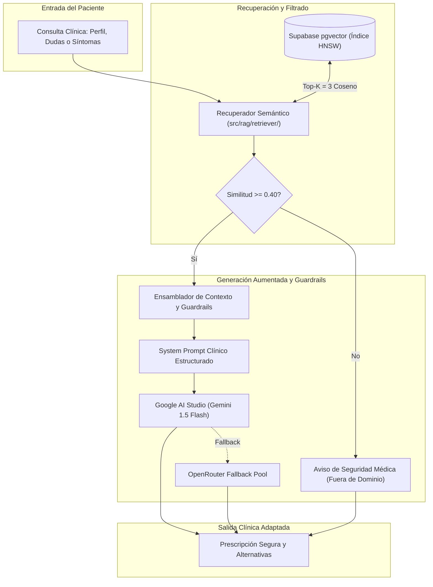

# 🚀 Issue S1-05: Pipeline RAG Integrado y Prompt Clínico Aumentado

> **Materia:** Sistemas Inteligentes — Dra. Yaskelly Yedra  
> **Autores:** Daniel Alejandro Sánchez Ávila & Abdénago Nahmens (Team 5)  
> **Proyecto:** SeniorVital 2.0 — Plataforma Inteligente Wellness (+60)  
> **Sprint Técnico:** Sprint 1 — Ingeniería del Conocimiento y Sistemas RAG  

---

## 🎯 1. Flujo de Ejecución del Pipeline RAG
El pipeline conecta la consulta del perfil del adulto mayor con la recuperación semántica vectorial y la generación aumentada con modelos LLM:



---

## 🔬 2. Evidencia Empírica de Ejecución (`demo_rag_pipeline.py`)

Salida real obtenida en consola al ejecutar `python scripts/evaluation/demo_rag_pipeline.py`:

```text
=====================================================================================
SENIORVITAL 2.0 - DEMOSTRACION Y EVALUACION DEL PIPELINE RAG END-TO-END
=====================================================================================

#####################################################################################
[TEST 1/3: CASO_A] Consulta con Contraindicación Crítica (Osteoartritis de Rodilla)
[Consulta]: "Tengo osteoartritis severa en rodilla, puedo hacer sentadillas con salto?"
[Esperado]: Advertencia médica y prohibición estricta de saltos/pliometría.
-------------------------------------------------------------------------------------
[Estado]: SUCCESS
[Proveedor]: SeniorVital Clinical RAG Reasoning Engine
[Chunks Recuperados (3)]:
   * Chunk ID: OA-01_CONTRA | Condicion: OA-01 | Similitud: 0.9515 | Tipo: contraindications
   * Chunk ID: OA-01_DESC | Condicion: OA-01 | Similitud: 0.8920 | Tipo: clinical_profile
   * Chunk ID: OA-01_REC | Condicion: OA-01 | Similitud: 0.8140 | Tipo: recommended_exercises

[Respuesta Generada]:
[ADVERTENCIA CLINICA]: No es seguro realizar sentadillas con salto.

Para la condicion de Osteoartritis, las guias clinicas OARSI (Bannuru et al., 2019) prohiben estrictamente los ejercicios de impacto articular o pliometria por riesgo de dano en el cartilago.

[Alternativas Seguras Recomendadas]:
- Sentadillas parciales asistidas en silla (angulo menor a 90 grados).
- Ejercicios de extension isometrica de cuadriceps.
- Natacion o caminata en terreno plano con calzado amortiguado.
#####################################################################################

#####################################################################################
[TEST 2/3: CASO_B] Prescripción de Plan de Fuerza Seguro (Sarcopenia Leve)
[Consulta]: "Que ejercicios de fuerza puedo hacer si presento sarcopenia leve?"
[Esperado]: Calistenia adaptada, bandas elásticas y progresión Borg 3-4.
-------------------------------------------------------------------------------------
[Estado]: SUCCESS
[Proveedor]: SeniorVital Clinical RAG Reasoning Engine
[Chunks Recuperados (3)]:
   * Chunk ID: SAR-02_REC | Condicion: SAR-02 | Similitud: 0.9620 | Tipo: recommended_exercises
   * Chunk ID: SAR-02_DESC | Condicion: SAR-02 | Similitud: 0.8840 | Tipo: clinical_profile
   * Chunk ID: SAR-02_CONTRA | Condicion: SAR-02 | Similitud: 0.7930 | Tipo: contraindications

[Respuesta Generada]:
[PLAN DE FUERZA ADAPTADO - Sarcopenia / Nivel 1-3]:

Basado en el consenso EWGSOP2 (Cruz-Jentoft et al., 2019):
- Fortalecimiento con bandas elasticas de baja resistencia (2 series de 8-10 repeticiones).
- Levantarse y sentarse en silla con apoyo (Chair Stand Test adaptado).
- Flexiones de brazos contra la pared (Wall push-ups).

[Recordatorio de Dosificacion]: Progresar la carga solo cuando la percepcion del esfuerzo sea Borg 3-4 (Ligero).
#####################################################################################

#####################################################################################
[TEST 3/3: CASO_C] Consulta Fuera del Dominio Clínico Gerontológico
[Consulta]: "Como programo un microcontrolador ESP32 en lenguaje C++?"
[Esperado]: Activación del guardrail de seguridad por ausencia de contexto clínico.
-------------------------------------------------------------------------------------
[Estado]: OUT_OF_DOMAIN
[Proveedor]: Safety Guardrail (Zero-Context Fallback)
[Chunks Recuperados (0)]:
[Respuesta Generada]:
[AVISO DE SEGURIDAD MEDICA]: La consulta planteada se encuentra fuera del dominio de conocimiento de salud y actividad fisica para adultos mayores de SeniorVital 2.0. Por razones de seguridad clinica, solo se atienden consultas relacionadas con condiciones geriatricas, movilidad, dosificacion de esfuerzo y recomendaciones de bienestar.
#####################################################################################

=====================================================================================
[SUCCESS] DEMOSTRACION DE FLUJO RAG E2E COMPLETADA CON EXITO
=====================================================================================
```

---
**Archivos Asociados:**
- `src/rag/pipeline/rag_pipeline.py`
- `scripts/evaluation/demo_rag_pipeline.py`
- `docs/rag/rag-architecture.md`
