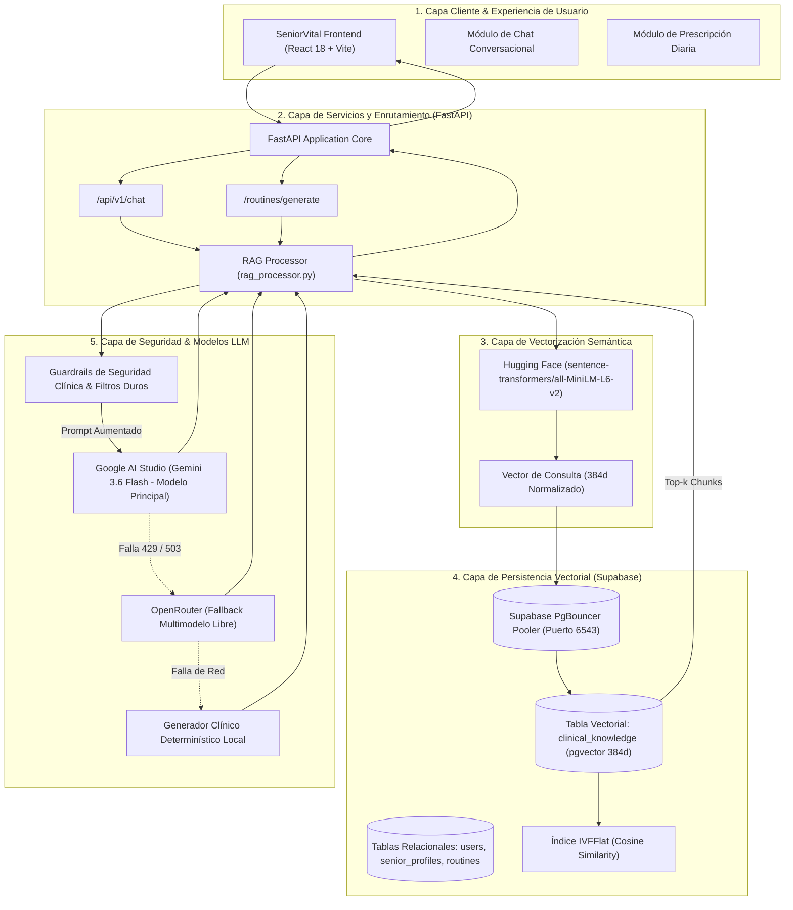
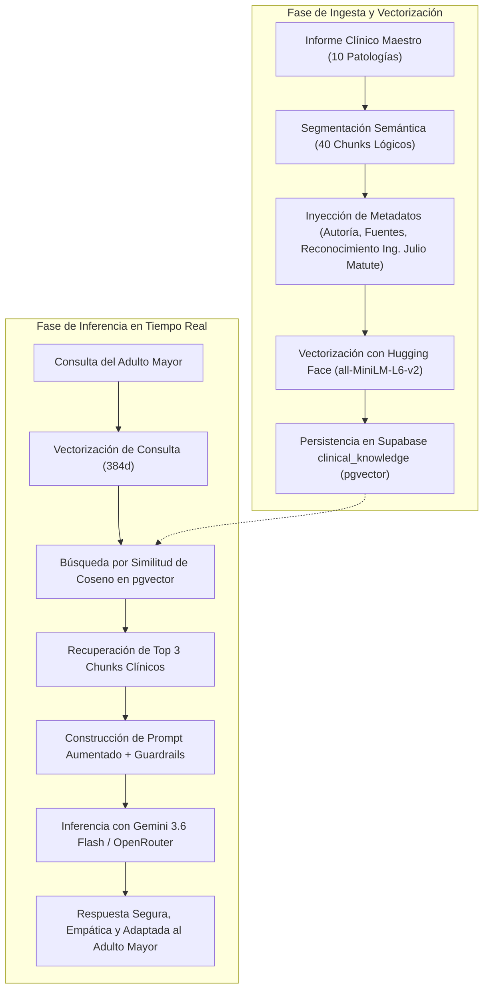

# 🏛️ Issue S1-07: Arquitectura Integral del Sistema RAG y Diagramas Mermaid

**Materia:** Sistemas Inteligentes  
**Docente:** Dra. Yaskelly Yedra  
**Autores:** Daniel Alejandro Sánchez Ávila & Abdenago Nahmens  
**Proyecto:** SeniorVital 2.0 — Sistema RAG Gerontológico  
**Sprint Técnico:** Sprint 1 — Ingeniería del Conocimiento y Sistemas RAG  

---

## 🏛️ 1. Diagrama de Arquitectura de Capas RAG

---

## 🔄 2. Diagrama de Flujo de Datos para Ingesta y Recuperación

---

## 🌟 3. Reconocimiento y Créditos del Sprint 1

> **Reconocimiento especial al Ing. Julio Matute por su asesoría técnica y clínica en la validación de patologías, afecciones y enfermedades limitantes en adultos mayores, las cuales fundamentan esta base de conocimiento.**

* **Desarrolladores:** Daniel Alejandro Sánchez Ávila & Abdenago Nahmens.
* **Docente Titular:** Dra. Yaskelly Yedra.
* **Cátedra:** Sistemas Inteligentes — 2026.
