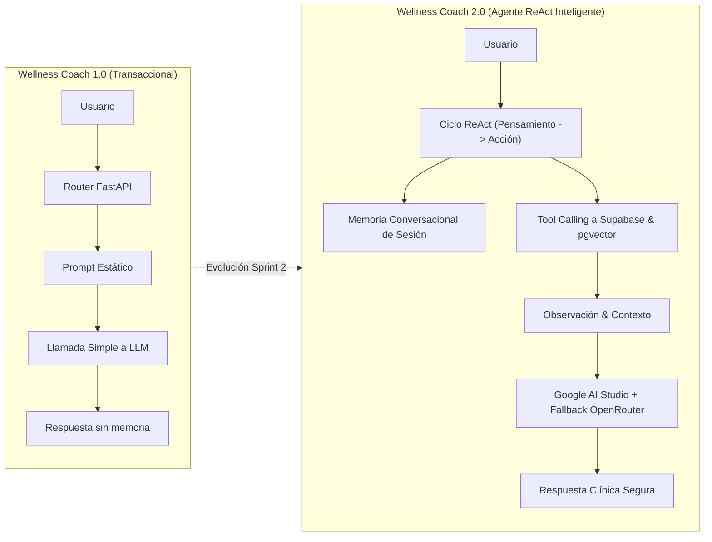

# 🔄 Issue S2-01: Refactorización y Evolución del Wellness Coach hacia Agente Inteligente

**Materia:** Sistemas Inteligentes  
**Docente:** Dra. Yaskelly Yedra  
**Autores:** Daniel Alejandro Sánchez Ávila & Abdenago Nahmens  
**Proyecto:** SeniorVital 2.0 — Agentes Inteligentes Modernos  
**Sprint Técnico:** Sprint 2 — Agentes Inteligentes, ReAct y Tool Calling  

---

## 🎯 1. Diagnóstico del Agente 1.0 vs Necesidades de la Versión 2.0

En la versión inicial transaccional, el asistente conversacional operaba como un pasamanos (*prompt forwarder*) con inyección básica de texto sin memoria de estado ni capacidad para inspeccionar de forma autónoma la base de datos de Supabase.

---

## 🛠️ 2. Cambios Arquitectónicos Aplicados en la Refactorización

1. **Desacoplamiento Modular:** Creación de `app/tools/clinical_tools.py` para separar las funciones de base de datos (*Tool Calling*) de la lógica de orquestación.
2. **Patrón ReAct Integrado:** Implementación del método `execute_react_cycle` en `app/agents/wellness_coach.py` para forzar razonamiento previo a la acción.
3. **Memoria de Sesión Dinámica:** Adición de `ConversationalMemoryManager` con control de turnos y retención de contexto a corto plazo.
4. **Resiliencia Multi-Proveedor:** Prioridad en Google AI Studio (`gemini-3.6-flash`) con conmutación en caliente hacia OpenRouter ante errores de cuota o timeouts.
