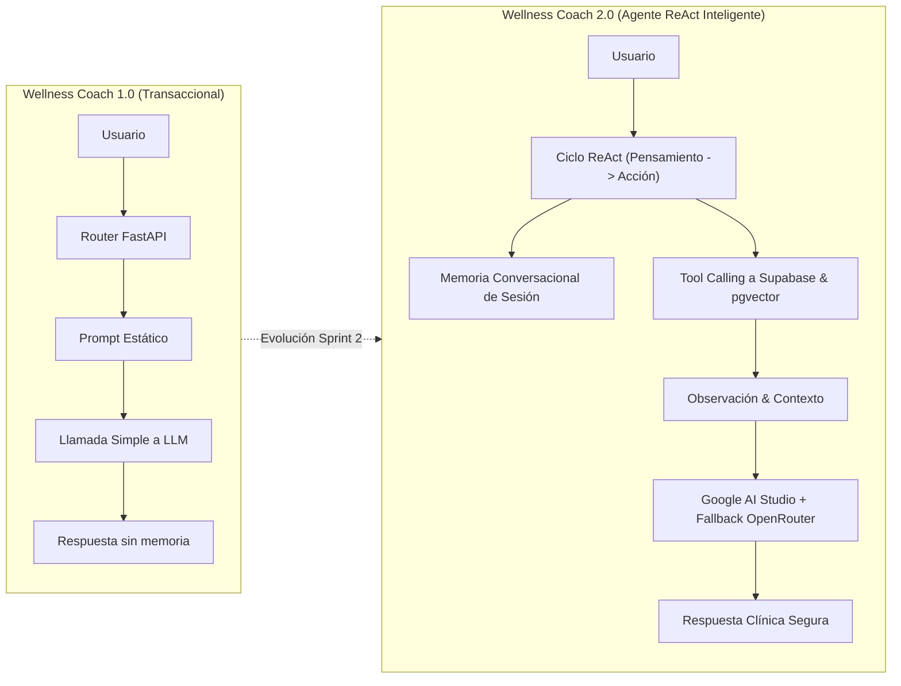

# 🔄 Issue S2-01: Refactorización y Evolución del Wellness Coach hacia Agente Inteligente

**Materia:** Sistemas Inteligentes  
**Docente:** Dra. Yaskelly Yedra  
**Autores:** Daniel Alejandro Sánchez Ávila & Abdenago Nahmens  
**Proyecto:** SeniorVital 2.0 — Agentes Inteligentes Modernos  
**Sprint Técnico:** Sprint 2 — Agentes Inteligentes, ReAct y Tool Calling  

---

## 🎯 1. Diagnóstico del Agente 1.0 vs Necesidades de la Versión 2.0

En la versión inicial transaccional, el asistente conversacional operaba como un pasamanos (*prompt forwarder*) con inyección básica de texto sin memoria de estado ni capacidad para inspeccionar de forma autónoma la base de datos de Supabase.

```mermaid
graph LR
    subgraph V1["Wellness Coach 1.0 (Transaccional)"]
        User1["Usuario"] --> Router1["Router FastAPI"]
        Router1 --> Prompt1["Prompt Estático"]
        Prompt1 --> LLM1["Llamada Simple a LLM"]
        LLM1 --> Resp1["Respuesta sin memoria"]
    end

    subgraph V2["Wellness Coach 2.0 (Agente ReAct Inteligente)"]
        User2["Usuario"] --> ReAct["Ciclo ReAct (Pensamiento -> Acción)"]
        ReAct --> Memory["Memoria Conversacional de Sesión"]
        ReAct --> Tools["Tool Calling a Supabase & pgvector"]
        Tools --> Obs["Observación & Contexto"]
        Obs --> Fallback["Google AI Studio + Fallback OpenRouter"]
        Fallback --> Resp2["Respuesta Clínica Segura"]
    end

    V1 -.->|Evolución Sprint 2| V2
```

---

## 🛠️ 2. Cambios Arquitectónicos Aplicados en la Refactorización

1. **Desacoplamiento Modular:** Definición de herramientas clínicas en `src/tools/wellness/` (`SafetyCheckTool`, `ExerciseCatalogTool`, `RAGSearchTool`, `LogHabitTool`) para separar las capacidades operativas de la orquestación.
2. **Patrón ReAct Integrado:** Implementación del motor de razonamiento en `src/agents/wellness/reasoning.py` e integración en `src/agents/wellness/coach.py` (`WellnessCoachAgent`), forzando el ciclo Thought → Action → Observation → Final Answer.
3. **Memoria Conversacional Persistente:** Conexión con `src/memory/postgres_store.py` (`PostgresMemoryStore`) en Supabase PostgreSQL con retención de contexto por sesión.
4. **Resiliencia Multi-Proveedor:** Inferencia primaria en Google Gemini Flash con conmutación hacia OpenRouter ante caídas o agotamiento de cuota.

---

## 🔍 3. Nota de Auditoría Técnica y Unificación Canónica

- **Alineación de Módulos:** Se depuraron y unificaron las referencias hacia `src/agents/wellness/coach.py`, eliminando la dependencia de código duplicado legacy. Cualquier llamada residual a `app/agents/` se redirige formalmente a la implementación canónica.
- **Estado Final:** ✅ **Completado, validado con herencia formal de `WellnessAgent` y listo para validación final.**

