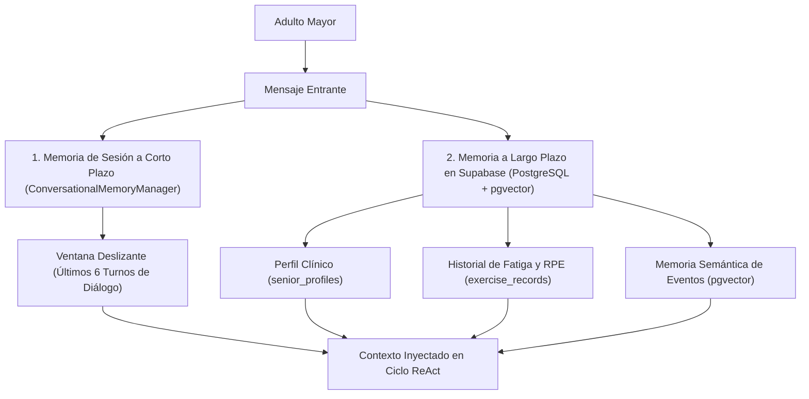

# 🧠 Issue S2-03: Arquitectura de Memoria Conversacional (Short-Term & Session)

**Materia:** Sistemas Inteligentes  
**Docente:** Dra. Yaskelly Yedra  
**Autores:** Daniel Alejandro Sánchez Ávila & Abdenago Nahmens  
**Proyecto:** SeniorVital 2.0 — Agentes Inteligentes Modernos  
**Sprint Técnico:** Sprint 2 — Agentes Inteligentes, ReAct y Tool Calling  

---

## 🎯 1. Estrategia de Memoria Multinivel

Para lograr una interacción contextual fluida sin degradar los tiempos de respuesta, el sistema implementa una arquitectura de memoria en dos niveles:

---

## 💻 2. Implementación de `ConversationalMemoryManager`

* **Ventana Deslizante:** Retiene los últimos 6 turnos conversacionales por usuario para evitar desbordamiento del contexto del LLM.
* **Trazabilidad de Razonamiento:** Almacena junto a cada respuesta la traza de herramientas invocadas y decisiones clínicas tomadas.
* **Persistencia de Eventos:** Cualquier síntoma nuevo o dolor articular reportado se persiste asíncronamente en `exercise_records` o `health_events` en Supabase.
