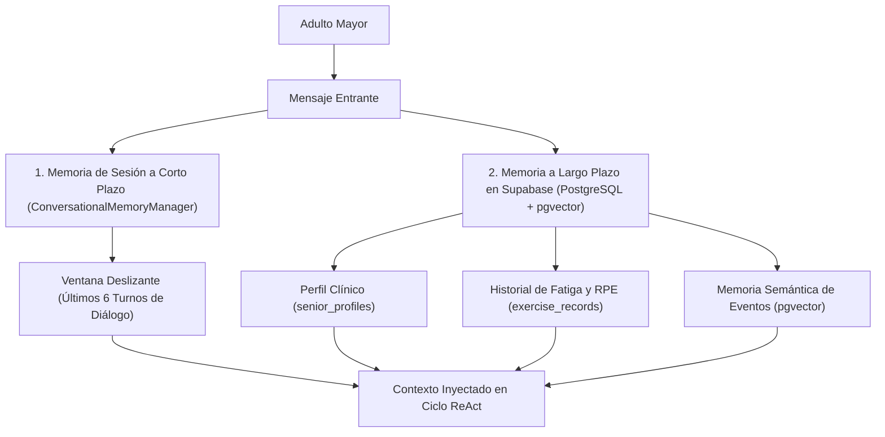

# 🧠 Issue S2-03: Arquitectura de Memoria Conversacional (Short-Term & Session)

**Materia:** Sistemas Inteligentes  
**Docente:** Dra. Yaskelly Yedra  
**Autores:** Daniel Alejandro Sánchez Ávila & Abdenago Nahmens  
**Proyecto:** SeniorVital 2.0 — Agentes Inteligentes Modernos  
**Sprint Técnico:** Sprint 2 — Agentes Inteligentes, ReAct y Tool Calling  

---

## 🎯 1. Estrategia de Memoria Multinivel

Para lograr una interacción contextual fluida sin degradar los tiempos de respuesta, el sistema implementa una arquitectura de memoria en dos niveles:

```mermaid
graph TD
    User["Adulto Mayor"] --> Msg["Mensaje Entrante"]
    Msg --> STM["1. Memoria de Sesión a Corto Plazo (ConversationalMemoryManager)"]
    STM --> Win["Ventana Deslizante (Últimos 6 Turnos de Diálogo)"]
    
    Msg --> LTM["2. Memoria a Largo Plazo en Supabase (PostgreSQL + pgvector)"]
    LTM --> Prof["Perfil Clínico (senior_profiles)"]
    LTM --> Hist["Historial de Fatiga y RPE (exercise_records)"]
    LTM --> Sem["Memoria Semántica de Eventos (pgvector)"]

    Win --> ReAct["Contexto Inyectado en Ciclo ReAct"]
    Prof --> ReAct
    Hist --> ReAct
    Sem --> ReAct
```

---

## 💻 2. Implementación de `ConversationalMemoryManager`

* **Ventana Deslizante:** Retiene los últimos 6 turnos conversacionales por usuario para evitar desbordamiento del contexto del LLM.
* **Trazabilidad de Razonamiento:** Almacena junto a cada respuesta la traza de herramientas invocadas y decisiones clínicas tomadas.
* **Persistencia de Eventos:** Cualquier síntoma nuevo o dolor articular reportado se persiste asíncronamente en `exercise_records` o `health_events` en Supabase.

---

## 🔍 3. Nota de Auditoría Técnica y Persistencia en Supabase

* **Persistencia Transaccional:** Se conectó `PostgresMemoryStore` (`src/memory/postgres_store.py`) hacia la tabla relacional `conversation_history` en PostgreSQL.
* **Eliminación de Memoria Volátil:** Se descartó el almacenamiento efímero en diccionarios en RAM en favor de operaciones ACID (`add_message`, `get_history`), garantizando recuperación de contexto entre reinicios y múltiples sesiones.
* **Conexión al Endpoint HTTP:** El endpoint `/api/v1/chat` recupera y persiste automáticamente el historial conversacional por `user_id`.
* **Evidencia Automatizada en CI:** Incorporamos la ejecución de la suite `tests/memory/test_postgres_store.py` al pipeline de GitHub Actions respaldada por el servicio contenedorizado de PostgreSQL 15, validando automáticamente el ciclo completo: guardar → recuperar → conservar contexto y límites por usuario.
* **Estado Final:** ✅ **Completado, verificado y listo para validación final.**

