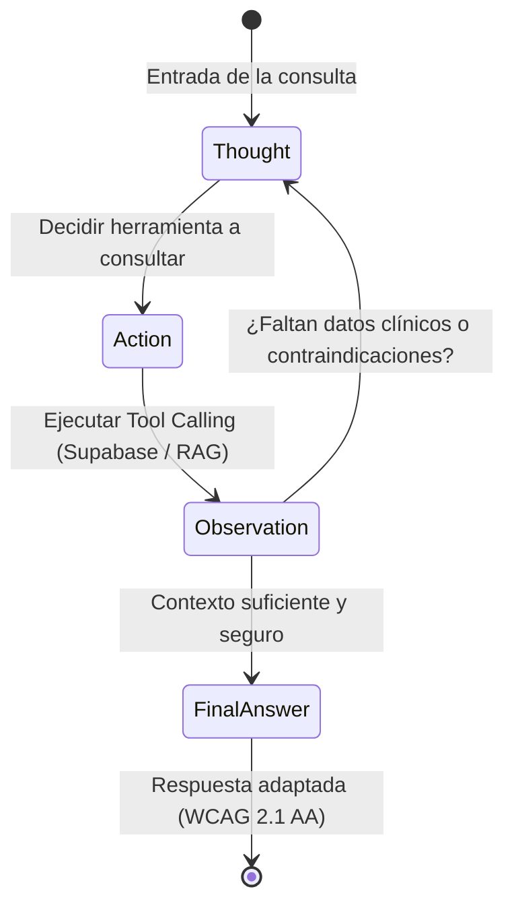

# 🔄 Issue S2-05: Implementación del Patrón ReAct (Reasoning + Action)

**Materia:** Sistemas Inteligentes  
**Docente:** Dra. Yaskelly Yedra  
**Autores:** Daniel Alejandro Sánchez Ávila & Abdenago Nahmens  
**Proyecto:** SeniorVital 2.0 — Agentes Inteligentes Modernos  
**Sprint Técnico:** Sprint 2 — Agentes Inteligentes, ReAct y Tool Calling  

---

## 🎯 1. Funcionamiento del Ciclo ReAct en SeniorVital

El patrón **ReAct (Yao et al., 2022)** combina la generación de trazas de razonamiento en lenguaje natural (*Reasoning*) con la ejecución de acciones sobre el entorno (*Actions*), permitiendo al agente gerontológico tomar decisiones clínicas justificadas:



---

## 📝 2. Traza Real de Ejecución ReAct (Ejemplo Clínico)

```text
[CONSULTA]: "Me duelen mucho las rodillas hoy, ¿puedo hacer sentadillas?"

[PASO 1: PENSAMIENTO (THOUGHT)]:
El usuario reporta dolor en rodillas y pregunta sobre sentadillas. Debo consultar su perfil clínico
para verificar antecedentes de osteoartritis y recuperar las contraindicaciones en la ontología RAG.

[PASO 2: ACCIÓN (ACTION)]:
- Invocar: consultar_restricciones_medicas(user_id="1")
- Invocar: consultar_base_conocimiento_rag(consulta="dolor rodilla sentadilla osteoartritis")

[PASO 3: OBSERVACIÓN (OBSERVATION)]:
- Supabase: "Paciente ID=1: Osteoartritis de rodilla bilateral, nivel de condición física 1/5."
- RAG: "Prohibida flexión profunda de rodilla >90° sin soporte. Permitida sentadilla parcial asistida en silla."

[PASO 4: RESPUESTA FINAL (FINAL ANSWER)]:
"¡Hola! Si siente dolor hoy, es muy importante cuidar sus articulaciones.
Le recomiendo evitar sentadillas profundas o cualquier esfuerzo que aumente la molestia.

En su lugar, puede realizar:
1. Sentadilla parcial asistida en silla: bajando solo un poco con apoyo de sus manos.
2. Extensiones suaves de rodilla sentado.

Si el dolor persiste o es punzante, descanse y consulte a su médico o fisioterapeuta."
```
