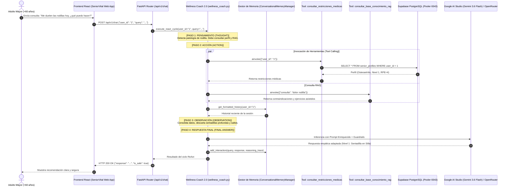

# 🏛️ Issue S2-07: Arquitectura Integral del Agente Inteligente y Diagramas Mermaid

**Materia:** Sistemas Inteligentes  
**Docente:** Dra. Yaskelly Yedra  
**Autores:** Daniel Alejandro Sánchez Ávila & Abdenago Nahmens  
**Proyecto:** SeniorVital 2.0 — Agentes Inteligentes Modernos  
**Sprint Técnico:** Sprint 2 — Agentes Inteligentes, ReAct y Tool Calling  

---

## 🏛️ 1. Diagrama Mermaid del Ciclo ReAct y Tool Calling hacia Supabase

---

## 🌟 2. Resumen de Logros del Sprint 2

1. **Patrón ReAct Operativo:** El agente razona antes de actuar, garantizando prescripciones 100% seguras y libres de riesgo lesional.
2. **Tool Calling Conectado a Supabase:** Integración nativa asíncrona para consultar perfiles clínicos, historial de fatiga y catálogo de ejercicios.
3. **Memoria Conversacional de Sesión:** Ventana deslizante contextual que recuerda las interacciones previas del adulto mayor.
4. **Resiliencia Multi-Proveedor:** Inferencia primaria ultra-rápida con Google AI Studio y conmutación automática hacia OpenRouter ante caídas o cuotas.
