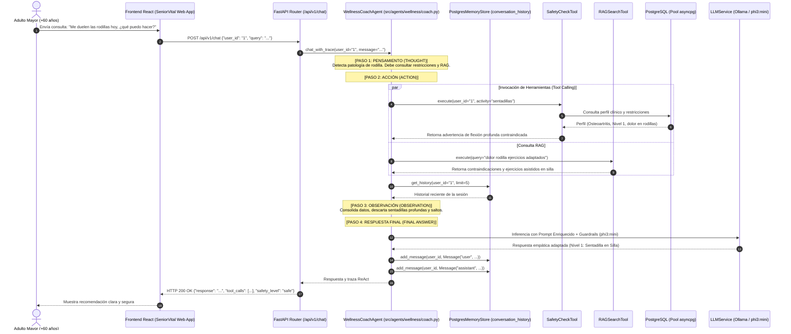

# 🏛️ Issue S2-07: Arquitectura Integral del Agente Inteligente y Diagramas Mermaid

**Materia:** Sistemas Inteligentes  
**Docente:** Dra. Yaskelly Yedra  
**Autores:** Daniel Alejandro Sánchez Ávila & Abdenago Nahmens  
**Proyecto:** SeniorVital 2.0 — Agentes Inteligentes Modernos  
**Sprint Técnico:** Sprint 2 — Agentes Inteligentes, ReAct y Tool Calling  

---

## 🏛️ 1. Diagrama Mermaid del Ciclo ReAct y Tool Calling hacia PostgreSQL

```mermaid
sequenceDiagram
    autonumber
    actor Senior as Adulto Mayor (+60 años)
    participant UI as Frontend React (SeniorVital Web App)
    participant Router as FastAPI Router (/api/v1/chat)
    participant Agent as WellnessCoachAgent (src/agents/wellness/coach.py)
    participant Memory as PostgresMemoryStore (conversation_history)
    participant Tool1 as SafetyCheckTool
    participant Tool2 as RAGSearchTool
    participant DB as PostgreSQL (Pool asyncpg)
    participant LLM as LLMService (Ollama / phi3:mini)

    Senior->>UI: Envía consulta: "Me duelen las rodillas hoy, ¿qué puedo hacer?"
    UI->>Router: POST /api/v1/chat {"user_id": "1", "query": "..."}
    Router->>Agent: chat_with_trace(user_id="1", message="...")

    Note over Agent: [PASO 1: PENSAMIENTO (THOUGHT)]<br/>Detecta patología de rodilla. Debe consultar restricciones y RAG.

    Note over Agent: [PASO 2: ACCIÓN (ACTION)]
    par Invocación de Herramientas (Tool Calling)
        Agent->>Tool1: execute(user_id="1", activity="sentadillas")
        Tool1->>DB: Consulta perfil clínico y restricciones
        DB-->>Tool1: Perfil (Osteoartritis, Nivel 1, dolor en rodillas)
        Tool1-->>Agent: Retorna advertencia de flexión profunda contraindicada

    and Consulta RAG
        Agent->>Tool2: execute(query="dolor rodilla ejercicios adaptados")
        Tool2-->>Agent: Retorna contraindicaciones y ejercicios asistidos en silla
    end

    Agent->>Memory: get_history(user_id="1", limit=5)
    Memory-->>Agent: Historial reciente de la sesión

    Note over Agent: [PASO 3: OBSERVACIÓN (OBSERVATION)]<br/>Consolida datos, descarta sentadillas profundas y saltos.

    Note over Agent: [PASO 4: RESPUESTA FINAL (FINAL ANSWER)]
    Agent->>LLM: Inferencia con Prompt Enriquecido + Guardrails (phi3:mini)
    LLM-->>Agent: Respuesta empática adaptada (Nivel 1: Sentadilla en Silla)

    Agent->>Memory: add_message(user_id, Message("user", ...))
    Agent->>Memory: add_message(user_id, Message("assistant", ...))
    Agent-->>Router: Respuesta y traza ReAct
    Router-->>UI: HTTP 200 OK {"response": "...", "tool_calls": [...], "safety_level": "safe"}
    UI-->>Senior: Muestra recomendación clara y segura
```

---

## 🌟 2. Resumen de Logros del Sprint 2

1. **Patrón ReAct Operativo:** El agente razona antes de actuar mediante el motor `ReActEngine`, garantizando prescripciones seguras y libres de riesgo lesional con ejecución dinámica de herramientas.
2. **Tool Calling Conectado a Base de Datos:** En el endpoint `/api/v1/chat` se inyectan 7 herramientas activas (`SafetyCheckTool`, `ExerciseCatalogTool`, `RAGSearchTool`, `LogHabitTool`, `GetHabitsTool`, `GetProgressTool`, `GetRoutineTool`), preservando `GenerateRoutineTool` a nivel de librería de servicios.
3. **Memoria Conversacional Persistente:** Conexión con `PostgresMemoryStore` sobre PostgreSQL, preservando el contexto histórico por sesión en `conversation_history` y verificada en CI mediante el contenedor de prueba.
4. **Servicio de Inferencia LLM:** `LLMService` basado en `OllamaClient`, con `OLLAMA_MODEL` configurado en `phi3:mini` por defecto (`http://localhost:11434`) mediante `WellnessConfig`, con manejo desacoplado de excepciones y fallbacks de seguridad.

---

## 🛠️ 3. Auditoría Técnica de Arquitectura Unificada y Cierre de Sprint

- **Unificación Arquitectónica:** Se eliminó la divergencia legacy entre `app/` y `src/`. El endpoint `POST /api/v1/chat` ejecuta canónicamente los componentes en `src/`, invocando `WellnessCoachAgent` (heredado de `WellnessAgent`), el motor `ReActEngine` (`reasoning.py`), las 7 herramientas inyectadas y `PostgresMemoryStore` sobre PostgreSQL.
- **Capa de Compatibilidad:** `app/agents/wellness_coach.py` opera exclusivamente como proxy de compatibilidad transitoria, calculando `elapsed_time` a partir de marcas temporales reales.
- **Sincronización Documental y Benchmark:** Métricas de evaluación sobre los 20 escenarios clínicos oficiales (`data/evaluation/coach_results/metrics_summary.json`):
  - **Escenarios evaluados:** 20 / 20 válidos.
  - **Safety Compliance:** 100.0%.
  - **Tool Selection Accuracy:** 97.0%.
  - **ReAct Flow Validity:** 100.0%.
  *(La retención de memoria conversacional se valida de forma independiente en `tests/memory/test_postgres_store.py`).*
- **Estado del Componente:** ✅ **Completado, validado mediante suite de integración automatizada y listo para validación final.**
