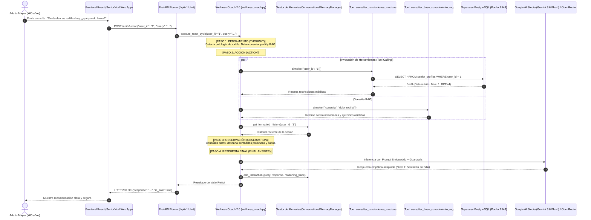

# 🏛️ Issue S2-07: Arquitectura Integral del Agente Inteligente y Diagramas Mermaid

**Materia:** Sistemas Inteligentes  
**Docente:** Dra. Yaskelly Yedra  
**Autores:** Daniel Alejandro Sánchez Ávila & Abdenago Nahmens  
**Proyecto:** SeniorVital 2.0 — Agentes Inteligentes Modernos  
**Sprint Técnico:** Sprint 2 — Agentes Inteligentes, ReAct y Tool Calling  

---

## 🏛️ 1. Diagrama Mermaid del Ciclo ReAct y Tool Calling hacia Supabase

```mermaid
sequenceDiagram
    autonumber
    actor Senior as Adulto Mayor (+60 años)
    participant UI as Frontend React (SeniorVital Web App)
    participant Router as FastAPI Router (/api/v1/chat)
    participant Agent as Wellness Coach 2.0 (wellness_coach.py)
    participant Memory as Gestor de Memoria (ConversationalMemoryManager)
    participant Tool1 as Tool: consultar_restricciones_medicas
    participant Tool2 as Tool: consultar_base_conocimiento_rag
    participant Supabase as Supabase PostgreSQL (Pooler 6543)
    participant LLM as Google AI Studio (Gemini 3.6 Flash) / OpenRouter

    Senior->>UI: Envía consulta: "Me duelen las rodillas hoy, ¿qué puedo hacer?"
    UI->>Router: POST /api/v1/chat {"user_id": "1", "query": "..."}
    Router->>Agent: execute_react_cycle(user_id="1", query="...")

    Note over Agent: [PASO 1: PENSAMIENTO (THOUGHT)]<br/>Detecta patología de rodilla. Debe consultar perfil y RAG.

    Note over Agent: [PASO 2: ACCIÓN (ACTION)]
    par Invocación de Herramientas (Tool Calling)
        Agent->>Tool1: ainvoke({"user_id": "1"})
        Tool1->>Supabase: SELECT * FROM senior_profiles WHERE user_id = 1
        Supabase-->>Tool1: Perfil (Osteoartritis, Nivel 1, RPE=4)
        Tool1-->>Agent: Retorna restricciones médicas

    and Consulta RAG
        Agent->>Tool2: ainvoke({"consulta": "dolor rodilla"})
        Tool2-->>Agent: Retorna contraindicaciones y ejercicios asistidos
    end

    Agent->>Memory: get_formatted_history(user_id="1")
    Memory-->>Agent: Historial reciente de la sesión

    Note over Agent: [PASO 3: OBSERVACIÓN (OBSERVATION)]<br/>Consolida datos, descarta sentadillas profundas y saltos.

    Note over Agent: [PASO 4: RESPUESTA FINAL (FINAL ANSWER)]
    Agent->>LLM: Inferencia con Prompt Enriquecido + Guardrails
    LLM-->>Agent: Respuesta empática adaptada (Nivel 1: Sentadilla en Silla)

    Agent->>Memory: add_interaction(query, response, reasoning_trace)
    Agent-->>Router: Resultado del ciclo ReAct
    Router-->>UI: HTTP 200 OK {"response": "...", "is_safe": true}
    UI-->>Senior: Muestra recomendación clara y segura
```

---

## 🌟 2. Resumen de Logros del Sprint 2

1. **Patrón ReAct Operativo:** El agente razona antes de actuar, garantizando prescripciones seguras y libres de riesgo lesional con ejecución dinámica de herramientas (`SafetyCheckTool`, `ExerciseCatalogTool`, `RAGSearchTool`, `LogHabitTool`).
2. **Tool Calling Conectado a Supabase:** Integración asíncrona para consultar perfiles clínicos, restricciones y base vectorial RAG.
3. **Memoria Conversacional Persistente:** Conexión con `PostgresMemoryStore` sobre Supabase PostgreSQL, preservando el contexto histórico por sesión sin depender de almacenamiento volátil en RAM.
4. **Resiliencia Multi-Proveedor:** Inferencia primaria con Google Gemini Flash y conmutación automática hacia OpenRouter ante caídas de servicio o límites de cuota.

---

## 🛠️ 3. Auditoría Técnica de Arquitectura Unificada y Cierre de Sprint

- **Unificación Arquitectónica:** Se eliminó la divergencia legacy entre `app/` y `src/`. El endpoint `POST /api/v1/chat` ahora ejecuta canónicamente los componentes en `src/`, invocando `WellnessCoachAgent` (heredado de `WellnessAgent`), el motor `ReActEngine` (`reasoning.py`), las 4 herramientas especializadas (`SafetyCheckTool`, `ExerciseCatalogTool`, `RAGSearchTool`, `LogHabitTool`) y `PostgresMemoryStore` sobre Supabase PostgreSQL.
- **Capa de Compatibilidad:** `app/agents/wellness_coach.py` opera exclusivamente como proxy de compatibilidad transitoria.
- **Sincronización Documental y Benchmark:** Se armonizaron las métricas de evaluación sobre los 20 escenarios clínicos (100.0% Safety Compliance, 97.0% Tool Accuracy) entre `metrics_summary.json`, el reporte de sprint y los issues técnicos.
- **Estado del Componente:** ✅ **Completado, validado mediante suite de integración automatizada y listo para validación final.**

