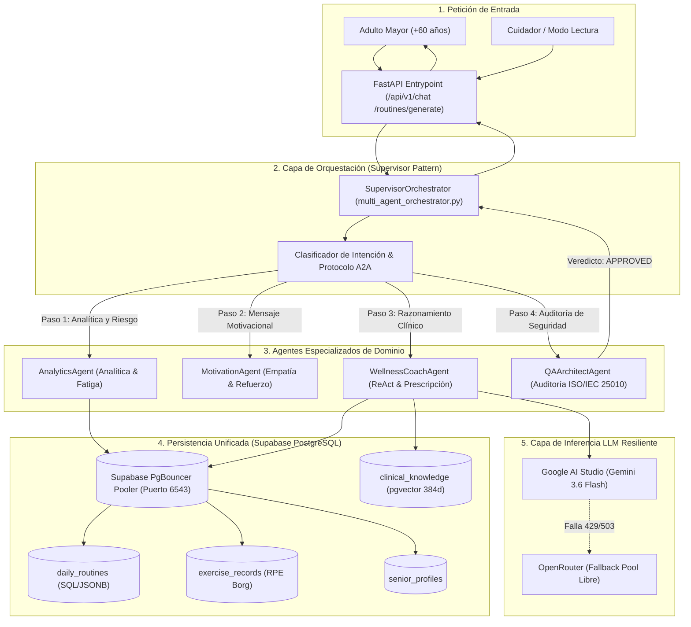

# 🏛️ Issue S3-01: Arquitectura del Ecosistema Multiagente y Orquestación Jerárquica

**Materia:** Sistemas Inteligentes  
**Docente:** Dra. Yaskelly Yedra  
**Autores:** Daniel Alejandro Sánchez Ávila & Abdenago Nahmens  
**Proyecto:** SeniorVital 2.0 — Sistemas Multiagentes y Orquestación  
**Sprint Técnico:** Sprint 3 — Arquitectura Multiagente y Supervisor Pattern  

---

## 🏛️ 1. Diagrama de Orquestación del Ecosistema Multiagente (Mermaid)

---

## 🎯 2. Justificación del Patrón Supervisor Jerárquico

* **Evita Ciclos Infinitos:** A diferencia de redes conversacionales no estructuradas (*Autogen o Swarm libre*), el Supervisor centraliza el flujo de control de forma acíclica y determinista.
* **Separación de Responsabilidades:** Cada agente atiende una dimensión clínica o técnica específica (analítica, motivación, razonamiento biomecánico o auditoría de calidad).
* **Cumplimiento ISO/IEC 25010:** El agente `QAArchitectAgent` intercepta las respuestas antes de su entrega al usuario para asegurar accesibilidad gerontológica (WCAG 2.1 AA) y ausencia total de prescripciones lesionales.
