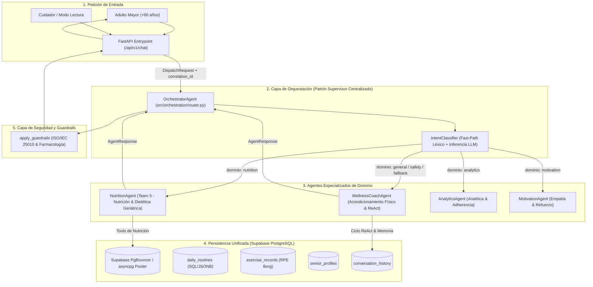

# 🏛️ Issue S3-01: Arquitectura del Ecosistema Multiagente y Patrón Supervisor Centralizado

**Materia:** Sistemas Inteligentes  
**Docente:** Dra. Yaskelly Yedra  
**Autores:** Daniel Alejandro Sánchez Ávila & Abdenago Nahmens  
**Proyecto:** SeniorVital 2.0 — Sistemas Multiagentes y Orquestación  
**Sprint Técnico:** Sprint 3 — Arquitectura Multiagente y Supervisor Pattern  
**Estado:** Implementado — pendiente de aprobación docente  

---

## 🏛️ 1. Diagrama de Orquestación del Ecosistema Multiagente (Mermaid)

```mermaid
graph TB
    subgraph Entrada["1. Petición de Entrada"]
        Senior["Adulto Mayor (+60 años)"]
        Caregiver["Cuidador / Modo Lectura"]
        API["FastAPI Entrypoint (/api/v1/chat)"]
    end

    subgraph Supervisor["2. Capa de Orquestación (Patrón Supervisor Centralizado)"]
        Orchestrator["OrchestratorAgent (src/orchestration/router.py)"]
        RouterPolicy["IntentClassifier (Fast-Path Léxico + Inferencia LLM)"]
    end

    subgraph Agentes_Especializados["3. Agentes Especializados de Dominio"]
        Nutrition["NutritionAgent (Team 5 - Nutrición & Dietética Geriátrica)"]
        Coach["WellnessCoachAgent (Acondicionamiento Físico & ReAct)"]
        Analytics["AnalyticsAgent (Analítica & Adherencia)"]
        Motivation["MotivationAgent (Empatía & Refuerzo)"]
    end

    subgraph Persistencia_Supabase["4. Persistencia Unificada (Supabase PostgreSQL)"]
        Supa_Pooler[("Supabase PgBouncer / asyncpg Pooler")]
        Table_Routines[("daily_routines (SQL/JSONB)")]
        Table_Records[("exercise_records (RPE Borg)")]
        Table_Profiles[("senior_profiles")]
        Table_Memory[("conversation_history")]
    end

    subgraph Seguridad_Guardrails["5. Capa de Seguridad y Guardrails"]
        Guardrails["apply_guardrails (ISO/IEC 25010 & Farmacología)"]
    end

    Senior --> API
    Caregiver --> API
    API -->|DispatchRequest + correlation_id| Orchestrator
    Orchestrator --> RouterPolicy

    RouterPolicy -->|dominio: nutrition| Nutrition
    RouterPolicy -->|dominio: general / safety / fallback| Coach
    RouterPolicy -->|dominio: analytics| Analytics
    RouterPolicy -->|dominio: motivation| Motivation

    Nutrition -->|Tools de Nutrición| Supa_Pooler
    Coach -->|Ciclo ReAct & Memoria| Table_Memory

    Nutrition -->|AgentResponse| Orchestrator
    Coach -->|AgentResponse| Orchestrator
    Orchestrator --> Guardrails
    Guardrails --> API
    API --> Senior
```

---

## 🎯 2. Comparativa Formal de Patrones y Justificación del Supervisor Centralizado

Evaluamos formalmente 4 patrones arquitectónicos para la orquestación multiagente:

1. **Sequential (Secuencial):** Cadena lineal rígida donde cada agente procesa en turno. Inadecuada para adultos mayores debido a latencia acumulativa alta e inflexibilidad ante consultas simples.
2. **Hierarchical (Jerárquico):** Árbol multinivel con supervisores de supervisores. Genera una sobrecarga severa de tokens y latencias superiores a 3.5 segundos, inviables en interfaces gerontológicas.
3. **Swarm (Enjambre / P2P):** Red descentralizada entre pares. Inadmisible para un sistema de salud al carecer de determinismo, corriendo riesgo de alucinaciones y bucles infinitos.
4. **Supervisor Centralizado (Seleccionado):** Un único orquestador analiza la intención, selecciona el agente especializado idóneo y despacha la tarea con validación estricta de guardrails.

### Justificación de Adopción:
* **Menor Sobrecarga de Tokens:** Resuelve la delegación en un único paso de clasificación (léxica o LLM).
* **Baja Latencia (< 1 segundo):** Garantiza fluidez cognitiva para usuarios mayores de 60 años.
* **Trazabilidad Determinista:** Propaga `correlation_id` en todas las transferencias inter-agente.
* **Erradicación Terminológica:** Eliminamos el término ambiguo *"Supervisor Jerárquico"*; el sistema es formalmente un **Supervisor Centralizado**.

---

## 🥗 3. Declaración del Agente Especializado Asignado: NutritionAgent (Team 5)

Declaramos formalmente que el **NutritionAgent** es el agente especializado asignado y desarrollado integralmente por el **Team 5**. Reside en `src/agents/nutrition/` y cuenta con herramientas especializadas:
- `NutritionCalculatorTool`: cálculo de tasa metabólica, balance calórico, distribución de macronutrientes e ingesta hídrica.
- `ClinicalDietaryCheckTool`: validación de restricciones alimentarias ante diagnósticos de diabetes, hipertensión y osteoartritis.
